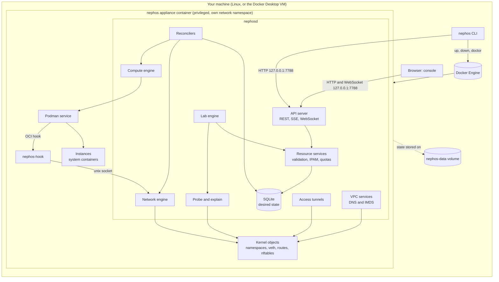
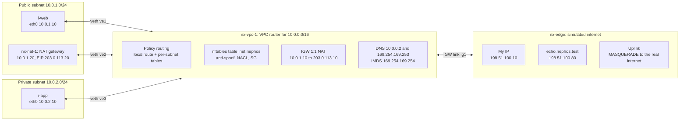
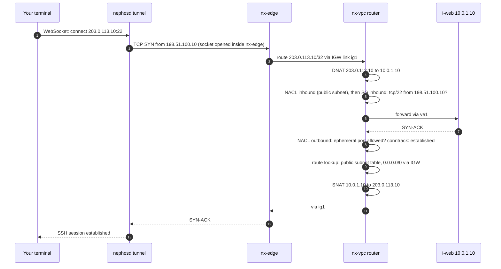

# Nephos Architecture

**Status:** proposed design (planning, September 2026). Decisions are referenced as ADR-NNNN; the [ADRs](adr/README.md) record the reasoning and the alternatives that were rejected.

## Contents

1. [Goals and non-goals](#1-goals-and-non-goals)
2. [System overview](#2-system-overview)
3. [Components](#3-components)
4. [Runtime layout inside the appliance](#4-runtime-layout-inside-the-appliance)
5. [Network data plane](#5-network-data-plane)
6. [API, CLI, and naming conventions](#6-api-cli-and-naming-conventions)
7. [State, reconciliation, and reset](#7-state-reconciliation-and-reset)
8. [Probe and explain](#8-probe-and-explain)
9. [Security model](#9-security-model)
10. [Observability and debugging](#10-observability-and-debugging)
11. [Testing strategy](#11-testing-strategy)
12. [Platform support](#12-platform-support)
13. [Repository structure](#13-repository-structure)
14. [Post-MVP architecture notes](#14-post-mvp-architecture-notes)

---

## 1. Goals and non-goals

| ID | Goal | What it means for the architecture |
|---|---|---|
| G1 | **Real behavior** | Network rules are enforced on real packets; instances are real Linux systems. |
| G2 | **Fail closed** | If enforcement can't be guaranteed, the appliance or resource fails loudly. Nothing is ever "stored but not enforced". |
| G3 | **Rebuildable** | The database is the source of truth. Every kernel and runtime object can be recreated from it. |
| G4 | **Host-safe** | All state lives in one container and one volume. Nothing runs in, or modifies, the host network namespace. |
| G5 | **Explainable** | Every enforcement decision traces back to a Nephos rule ID. The static analyzer and the data plane share one semantics catalog. |
| G6 | **Portable** | Linux first; Docker Desktop on macOS and Windows through the same appliance image. |
| G7 | **Small and inspectable** | One control-plane binary; readable rulesets; debug commands that show exactly what the kernel is doing. |

**Non-goals:** AWS wire compatibility, multiple hosts, a highly available control plane, multi-tenant security isolation, IAM.

## 2. System overview



**How a change flows through the system:**

1. The CLI or console calls the REST API.
2. Resource services validate the request and write the **desired state** to SQLite.
3. Reconcilers converge the **actual state**: kernel networking objects through the network engine, and instances through Podman.
4. When an instance starts, Podman runs `nephos-hook`, which asks the network engine to wire the instance's interface before its first process runs.
5. Everything the learner does over the network enters through the simulated internet ([§5](#5-network-data-plane), [ADR-0006](adr/0006-learner-access-through-simulated-internet.md)).

## 3. Components

### 3.1 `nephos` CLI (runs on the host)

- **Appliance lifecycle:** `up`, `down`, `doctor`, and `reset --hard`, through the Docker Engine API ([ADR-0003](adr/0003-appliance-container-packaging.md)).
- **Resources:** all resource commands go through the REST API using the generated client `pkg/client` ([ADR-0008](adr/0008-rest-openapi-api-not-aws-compatible.md)).
- **Access:** `ssh`, `proxy`, `forward`, and `console` open WebSocket tunnels through `nephosd`.
- **Labs and diagnostics:** `lab`, `probe`, `explain`, `debug`, `events`, `logs`.
- **Local files:** configuration in `~/.nephos/config.yaml`; the API token in `~/.nephos/credentials` (mode 0600).
- Runs natively on Linux, macOS, and Windows.

### 3.2 `nephosd` (runs inside the appliance)

A single Go binary ([ADR-0002](adr/0002-go-for-control-plane-and-cli.md)) with these modules:

| Module | Responsibility | Depends on |
|---|---|---|
| **API server** | Generated OpenAPI handlers; auth middleware; SSE event stream; WebSocket endpoints for terminals and tunnels; serves the embedded console | Resource services |
| **Resource services** | Validation (CIDR rules, overlaps, reserved addresses); IPAM; ID and name allocation; quotas and capacity; dependency checks; AWS-style errors; writes desired state plus events in one transaction and enqueues reconcile keys | Store |
| **Store** | SQLite access, migrations, generated queries ([ADR-0007](adr/0007-sqlite-state-and-reconciliation.md)) | none |
| **Reconcile framework** | Work queue, per-key serialization, backoff, periodic resync, status write-back | Store |
| **Network engine** | Namespaces, links, addresses, routes, policy rules, per-namespace sysctls, nftables rendering and atomic apply ([ADR-0005](adr/0005-nephos-owned-routed-network-plane.md)) | Kernel via netlink and `nft` |
| **Compute engine** | `compute.Runtime` and its Podman implementation; instance-type limits; image cache; the hook endpoint ([ADR-0004](adr/0004-instances-as-system-containers.md)) | Podman API |
| **VPC services** | Per-VPC DNS resolver and instance metadata service (IMDS) listeners, opened inside VPC namespaces | Network engine (netns helper) |
| **Probe engine** | Opens real connections from vantage points and classifies the results | Network engine (netns helper) |
| **Explain engine** | Pure static analysis of reachability over a desired-state snapshot | none (pure) |
| **Lab engine** | Lab loading, schema validation, CEL environment, checks, runner, progress ([ADR-0010](adr/0010-lab-format-yaml-cel-probes.md), [LABS.md](LABS.md)) | Resource services, probe, explain |
| **Access tunnels** | WebSocket-to-TCP connections dialed from `nx-edge`; serial-console exec sessions | Network engine, compute engine |

Idempotent network engine operations, used by reconcilers (sketch):

```go
type NetworkEngine interface {
    EnsureEdge(ctx context.Context, cfg EdgeConfig) error
    EnsureVPC(ctx context.Context, desired VPCDesiredState) (VPCObserved, error) // links, routes, rules, ruleset
    DeleteVPC(ctx context.Context, vpcID string) error
    EnsureNATGateway(ctx context.Context, desired NATGatewayDesiredState) error
    DeleteNATGateway(ctx context.Context, natID string) error
    PlumbInstance(ctx context.Context, pid int, enis []ENIDesiredState) error    // called via nephos-hook
    Observe(ctx context.Context) (ObservedNetwork, error)                        // drift detection and leak checks
}
```

### 3.3 `nephos-hook`

A tiny binary registered as a Podman OCI hook at the `createRuntime` stage, applied only to containers labeled `io.nephos.instance-id`.

- It reads the container state (including its PID) from stdin and calls `nephosd` over `/run/nephos/hook.sock`.
- If the network wiring fails, it exits non-zero, so the instance fails to start instead of booting without its network.
- It contains no logic of its own.

### 3.4 Podman service

- Rootful Podman API service inside the appliance.
- Storage in `/var/lib/nephos/containers` on the volume.
- The Nephos hook is configured in its hooks directory.
- Podman-managed networks are never used.

### 3.5 Web console

A React single-page app ([ADR-0009](adr/0009-web-console-react-typescript.md)) embedded in `nephosd`. Views:

- dashboard;
- resource pages for VPCs, subnets, route tables, gateways, Elastic IPs, security groups, network ACLs, instances, and key pairs;
- live topology with an explain overlay;
- terminals (serial console and Instance Connect);
- labs.

### 3.6 AMIs and lab content

- **AMIs:** OCI images built from `images/amis/`, published to GHCR, pulled once, and cached in the appliance.
- **Labs:** built-in labs in `labs/` are embedded into `nephosd` at build time.

## 4. Runtime layout inside the appliance

| Object | Location | Notes |
|---|---|---|
| `nephosd` | Appliance root network namespace | Listens on port 7788 inside the container; published on the host as **127.0.0.1:7788** only |
| Podman API service and `conmon` processes | Appliance root namespace | Unix socket, never exposed |
| `nx-edge` | Named network namespace | The simulated internet ([§5](#5-network-data-plane)) |
| `nx-vpc-<short>` | Named network namespace, one per VPC | The VPC router: routing tables, rules, nftables, DNS/IMDS sockets |
| `nx-nat-<short>` | Named network namespace, one per NAT gateway | Forwarding and masquerade |
| Instance namespaces | One set per running instance | Created with the instance's user namespace; wired by `nephos-hook` |

`<short>` is a base-36 index allocated in the database (for example `nx-vpc-3f`). Combined with interface prefixes such as `ve`, `ig`, and `sn`, it keeps every Linux interface name within the kernel's 15-character limit. The mapping between short indexes and resource IDs lives only in the database.

Filesystem layout on the `nephos-data` volume:

```text
/var/lib/nephos/
├── nephos.db          # SQLite database (WAL mode)
├── containers/        # Podman storage: AMI layers and instance root volumes
├── labs/              # lab attempt artifacts (check logs, script output)
└── secrets/           # API token and console session signing key
```

Runtime-only paths (tmpfs, rebuilt at every start):

- `/run/nephos/hook.sock`: hook socket.
- `/run/netns/nx-*`: named network namespaces.

## 5. Network data plane

The network plane is Nephos's core ([ADR-0005](adr/0005-nephos-owned-routed-network-plane.md)). The picture below shows one VPC with a public subnet (a web instance and a NAT gateway) and a private subnet (an app instance). Subnet boxes are **logical groupings**: there is no per-subnet bridge. Every interface connects directly to its VPC router.



**Traffic paths in this example:**

- **`i-app` updates packages.** Private route table: 0.0.0.0/0 → NAT gateway, via `ve2`. The NAT gateway masquerades to 10.0.1.20 and sends the packet back to the router. Public route table: 0.0.0.0/0 → IGW. At the IGW link, the source becomes 203.0.113.20. `nx-edge` then masquerades out to the real internet.
- **The learner SSHes to `i-web`.** A tunnel dials 203.0.113.10:22 from 198.51.100.10 inside `nx-edge`. The VPC router DNATs to 10.0.1.10, checks the public subnet's NACL and `i-web`'s security groups, and forwards through `ve1`.

### 5.1 How each cloud concept is implemented on the host

| Cloud concept | Host implementation | Names | Behavior and enforcement |
|---|---|---|---|
| **Region / availability zone** | Logical labels in the database | `local-1`, `local-1a`, `local-1b`, `local-1c` | Subnets are placed in an AZ. No failure domains in the MVP (fault injection later). |
| **Workspace** (≈ AWS account) | Database scope with its own default VPC and quotas | `default`, `lab-<lab-id>-<n>` | Workspaces never share namespaces, rules, or names. |
| **VPC** | A network namespace acting as the implicit router; IPv4 forwarding on; a dummy interface holds router addresses | `nx-vpc-<short>`, `vpc-…` | CIDR between /16 and /28. Different VPCs may overlap. |
| **Default VPC** | Created with each workspace: 172.31.0.0/16, one /20 subnet per AZ, an attached IGW, main route table with 0.0.0.0/0 → IGW, public IPs on launch | `vpc-…` (tagged default) | Mirrors a fresh AWS account. |
| **Subnet** | Logical: gateway `.1` on the router's dummy interface; an nftables interface-name set of member ENIs; route table and NACL associations | set `sn_<short>`, `subnet-…` | 5 reserved addresses (network, `.1`, `.2`, `.3`, broadcast). Must lie inside the VPC CIDR and not overlap another subnet. |
| **Elastic network interface (ENI)** | A veth pair. Router end `ve<short>` with proxy ARP and a /32 route; instance end `eth0` with the subnet prefix and default gateway `.1`, moved into the instance by `nephos-hook` | `ve<short>`, `eni-…` | Security groups attach here. The source/dest check drops spoofed source addresses. |
| **Instance** | A Podman system container: systemd, sshd, cloud-init, `userns=auto`, cgroup limits | Container name = `i-…` | See [ADR-0004](adr/0004-instances-as-system-containers.md) for deviations from EC2. |
| **Instance type** | CPU quota, memory limit, pids limit | `t3.nano` (2 vCPU, 0.5 GiB), `t3.micro` (2 vCPU, 1 GiB), `t3.small` (2 vCPU, 2 GiB), `t3.medium` (2 vCPU, 4 GiB) | vCPU and memory match AWS. CPU is capped by the appliance's CPUs. No CPU credits or bandwidth limits. |
| **AMI** | An OCI image with systemd, sshd, and cloud-init; the ID maps to an image digest | `ubuntu-24.04`, `ami-…` | Pulled once and cached on the volume. |
| **Key pair** | Public key stored in the database; the private key is returned once at creation and never stored (or you import your own public key) | `key-…` | Served at IMDS `public-keys`; cloud-init installs it for the default user. |
| **Route table** | A Linux routing table (ID 1000 + index) in the VPC namespace, plus `ip rule iif ve<short> lookup <table>` for each ENI in associated subnets | `rtb-…` | The local-route rule always comes first. Unmatched traffic hits a silent blackhole. Routes whose target was deleted become blackhole routes, with status `blackhole` in the API. |
| **Main route table** | The table used by subnets with no explicit association | `rtb-…` (main) | Adding 0.0.0.0/0 → IGW here makes every unassociated subnet public, a classic mistake reproduced faithfully. |
| **Internet gateway** | A veth pair between the VPC namespace and `nx-edge`; 1:1 NAT rules on that link inside the VPC namespace; routes in `nx-edge` for the VPC's public /32s | `ig<short>`, `igw-…` | Must be attached. Only ENIs with a public or Elastic IP can reach the internet; inbound works only to mapped public IPs. |
| **Public IPv4 / Elastic IP** | An address from 203.0.113.0/24 with an SNAT/DNAT pair and an edge route | `eipalloc-…` | An auto-assigned public IP changes across stop/start; an EIP persists. Quota: 5 EIPs per workspace. |
| **NAT gateway** | A network namespace with an ENI in its subnet (no SGs), a required EIP, forwarding, masquerade, `send_redirects=0` | `nx-nat-<short>`, `nat-…` | Works only if *its* subnet routes 0.0.0.0/0 → IGW. States: `pending` → `available`. |
| **Security group** | Per-ENI chains `sg_in_<eni>` and `sg_out_<eni>` built from every attached SG; IP sets for SG references; conntrack for statefulness | `sg-…`, rules `sgr-…` | New SG: all egress allowed, no ingress. Default SG: ingress from its own members. Up to 5 SGs per ENI. Blocked packets are dropped, so connections time out. |
| **Network ACL** | Per-subnet chains `nacl_in_<subnet>` and `nacl_out_<subnet>`; rules in rule-number order; allow = `return`, deny = `drop`, final `drop` | `acl-…` | Stateless. Applies only when crossing a subnet boundary. Default NACL allows everything; a custom NACL denies everything until you add rules. |
| **VPC DNS** | A Go resolver listening inside the VPC namespace on base+2 and 169.254.169.253; answers private hostnames and forwards other queries upstream from the appliance | `ip-10-0-1-10.local-1.compute.internal` | Works without an internet gateway, as in AWS. Honors `enable_dns_support` and `enable_dns_hostnames`. |
| **Instance metadata (IMDS)** | A Go HTTP server on 169.254.169.254:80 inside the VPC namespace; identifies the caller by source address and incoming interface; IMDSv1 and IMDSv2 tokens | `/latest/meta-data/…` | `http_tokens` = `optional` or `required` per instance (teaches IMDSv2). No IAM credential paths. |
| **User data** | Stored with the instance, served at `/latest/user-data`, run by cloud-init at first boot | — | Output appears in `/var/log/cloud-init-output.log` inside the instance. |
| **Simulated internet** | `nx-edge`: My IP 198.51.100.10; `echo.nephos.test` at 198.51.100.80; an uplink with MASQUERADE (disabled by `--sealed`) | `nx-edge` | See [ADR-0006](adr/0006-learner-access-through-simulated-internet.md). |
| **Serial console** | A Podman exec session, clearly labeled as out-of-band | — | Bypasses networking by design; used to recover from lockouts. |

### 5.2 Rule evaluation order

Each VPC namespace holds one nftables table. The whole table is rendered from desired state and replaced atomically with `nft -f` (a simplified excerpt):

```text
table inet nephos {
  map sg_egress_by_eni  { type ifname : verdict; elements = { "ve1" : jump sg_out_ve1, "ve3" : jump sg_out_ve3 } }
  map sg_ingress_by_eni { type ifname : verdict; elements = { "ve1" : jump sg_in_ve1,  "ve3" : jump sg_in_ve3 } }

  chain prerouting  { type nat hook prerouting priority dstnat; policy accept;
    iifname "ig1" ip daddr 203.0.113.10 dnat ip to 10.0.1.10 comment "nephos:eipassoc:auto-i-web" }
  chain postrouting { type nat hook postrouting priority srcnat; policy accept;
    oifname "ig1" ip saddr 10.0.1.10 snat ip to 203.0.113.10 comment "nephos:eipassoc:auto-i-web" }

  chain forward {
    type filter hook forward priority filter; policy drop;
    jump antispoof
    iifname @sn_pub  oifname != @sn_pub  jump nacl_out_pub     # NACLs: stateless, subnet boundary only
    oifname @sn_pub  iifname != @sn_pub  jump nacl_in_pub
    iifname @sn_priv oifname != @sn_priv jump nacl_out_priv
    oifname @sn_priv iifname != @sn_priv jump nacl_in_priv
    ct state established,related accept                        # SGs are stateful
    ct state invalid drop
    iifname vmap @sg_egress_by_eni                             # source ENI's SG egress rules
    oifname vmap @sg_ingress_by_eni                            # destination ENI's SG ingress rules
    accept
  }

  chain sg_in_ve1 {
    tcp dport 22 ip saddr 198.51.100.10 counter return comment "nephos:sgr-0c1d2e3f4a5b6c7d8"
    counter drop
  }

  chain input {
    type filter hook input priority filter; policy drop;
    ip daddr { 10.0.0.2, 169.254.169.253 } udp dport 53 accept   # SGs and NACLs don't filter VPC DNS or IMDS, as in AWS
    ip daddr { 10.0.0.2, 169.254.169.253 } tcp dport 53 accept
    ip daddr 169.254.169.254 tcp dport 80 accept
  }
}
```

Every rendered rule carries a `counter` and a `comment` holding its Nephos rule ID. `explain` (M5) and flow logs (M11) use these to point at the exact rule responsible.

### 5.3 Packet walk: SSH from the learner to a public instance



**Where each misconfiguration breaks this flow, and what the learner sees:**

| Misconfiguration | Where it fails | Learner sees |
|---|---|---|
| SG has no tcp/22 rule from My IP | Step 5 | `Connection timed out` |
| Public subnet's route table lacks 0.0.0.0/0 → IGW | Step 9 (reply blackholed) | `Connection timed out` |
| Instance has no public IP | Step 3 (unassigned pool addresses are blackholed in `nx-edge`, as they silently go nowhere in AWS) | `Connection timed out`. `nephos ssh` checks first and suggests a bastion or an Elastic IP. |
| NACL outbound lacks ephemeral ports | Step 8 | `Connection timed out` |
| `sshd` stopped inside the instance | Step 7 (the instance answers with a reset) | `Connection refused` |

### 5.4 Instance launch sequence

```mermaid
sequenceDiagram
  autonumber
  participant C as CLI or console
  participant A as API and services
  participant S as SQLite
  participant Q as Reconcilers
  participant P as Podman
  participant H as nephos-hook
  participant N as Network engine
  participant M as IMDS
  participant I as Instance
  C->>A: POST /v1/workspaces/default/instances
  A->>A: validate subnet, SGs, key pair, capacity; allocate private IP and ENI
  A->>S: insert instance (pending), ENI, event in one transaction
  A-->>C: 201 Created, state pending
  Q->>S: read desired state
  Q->>N: ensure router end of ENI, routes, rules, nftables ruleset
  Q->>P: create container (systemd, userns auto, limits, labels)
  Q->>P: start container
  P->>H: createRuntime hook with container PID
  H->>N: plumb eth0 into instance namespace (address, gateway, MTU)
  N-->>H: ok
  P->>I: start systemd as PID 1
  Q->>S: state running
  A-->>C: SSE event: instance running (CLI --wait returns)
  I->>M: cloud-init fetches meta-data, public-keys, user-data
  M-->>I: identity, SSH public key, user data
```

As in AWS, `running` means the machine has started, not that SSH is ready. Instance status checks (for example "sshd reachable") are a post-MVP addition.

### 5.5 AWS fidelity and known deviations

| Area | Matches AWS | Documented deviations |
|---|---|---|
| **Addressing** | 5 reserved IPs per subnet; VPC /16–/28; default VPC layout; private DNS names | MTU 1500 or lower (AWS: 9001); IPv4 only in the MVP |
| **Routing** | Local route; main route table; per-subnet association; blackhole status; longest-prefix match | No gateway route tables (edge associations), peering, or transit gateways in the MVP; the local route can't be overridden with more-specific routes |
| **IGW and public IPs** | 1:1 NAT; the instance doesn't see its public IP; auto-assigned public IPs change across stop/start; Elastic IPs | Public addresses come from 203.0.113.0/24 and are reachable only through Nephos access paths |
| **NAT gateway** | Needs an EIP; lives in a subnet; no SGs; depends on its subnet's route table | Private NAT gateways, bandwidth limits, and idle timeouts not modeled |
| **Security groups** | Stateful; allow rules only; SG references; default SG behavior; applies within a subnet; blocked traffic times out | All flows are tracked (AWS's untracked-connection nuance isn't modeled); quotas simplified |
| **Network ACLs** | Stateless; ordered rule numbers; default allow-all; custom deny-all; subnet boundary only; don't filter VPC DNS or IMDS | None known |
| **DNS and IMDS** | Resolver at base+2 and 169.254.169.253; IMDSv1 and v2; user data; public keys | No Route 53 hosted zones in the MVP; no IAM credential paths |
| **Instances** | Lifecycle states; vCPU and memory per instance type; user data; key pairs; serial console | Shared kernel; no raw block devices; `free` and `nproc` show appliance totals; reboot is a container restart; no CPU credits |
| **Regions and AZs** | AZ names and subnet placement | Logical only; one region |
| **Names** | `Name` tag | Unique per resource type within a workspace |

Behavior changes to the network plane must update this table in the same pull request.

## 6. API, CLI, and naming conventions

The full API rules are in [ADR-0008](adr/0008-rest-openapi-api-not-aws-compatible.md). In short:

- `api/openapi.yaml` is the source of truth; paths look like `/v1/workspaces/{workspace}/<resources>/{id}`.
- IDs look like AWS IDs (`vpc-0a1b2c3d4e5f67890`).
- Fields are snake_case, named like the Terraform AWS provider's attributes.
- Error codes follow EC2 (`DependencyViolation`, `InvalidSubnet.Conflict`, …).
- Creates accept an `Idempotency-Key` header.
- `/v1/events` streams server-sent events.

M1 implements these core rules for VPCs, subnets, and instances in one implicit
`default` workspace. It retains the workspace path so later workspace support
does not change resource URLs. Arbitrary tags and broader list filters arrive
in M3; the M1 list endpoints are still paginated. The M1 API token and
localhost binding protect its resource, event, and console endpoints.

**CLI grammar:** `nephos <resource> <verb> [name-or-id] [flags]`. Flags are kebab-case versions of the API field names. Anywhere a resource is referenced, either its name or its ID works.

```bash
nephos up --memory 6g --cpus 4
nephos vpc create main --cidr-block 10.0.0.0/16
nephos subnet create public-a --vpc main --cidr-block 10.0.1.0/24 \
    --availability-zone local-1a --map-public-ip-on-launch
nephos igw create main-igw
nephos igw attach main-igw --vpc main
nephos route-table create public-rt --vpc main
nephos route create --route-table public-rt --destination-cidr-block 0.0.0.0/0 --gateway main-igw
nephos route-table associate public-rt --subnet public-a
nephos sg create web --vpc main --description "web servers"
nephos sg authorize-ingress web --protocol tcp --port 22 --cidr my-ip
nephos key-pair create me --output-file ~/.ssh/nephos-me.pem
nephos instance run web-1 --ami ubuntu-24.04 --instance-type t3.micro --subnet public-a \
    --security-groups web --key-pair me --user-data file://init.sh --wait
nephos ssh web-1
nephos probe --from internet --to web-1 --port tcp/80
nephos explain --from internet --to web-1 --port tcp/80
nephos lab start nat-troubleshooting
```

**Conventions:**

- **Output:** human-readable tables by default; `-o json` or `-o yaml` prints the exact API objects.
- **Waiting:** `--wait` blocks until an asynchronous operation reaches a stable state.
- **`my-ip`:** accepted wherever a CIDR is expected; it means 198.51.100.10/32.
- **Workspaces:** M1 uses one implicit `default` workspace. When workspace
  selection arrives, it uses `--workspace` or `nephos workspace use <name>`;
  `nephos lab start` switches to the lab's workspace and `nephos lab finish`
  switches back.
- **Exit codes:**

  | Code | Meaning |
  |---|---|
  | 0 | Success |
  | 1 | Error |
  | 2 | Usage error |
  | 3 | A check did not match its expectation (`probe --expect`, `lab check`) |

## 7. State, reconciliation, and reset

The full design is in [ADR-0007](adr/0007-sqlite-state-and-reconciliation.md). Operational details:

- **Generations:** every resource row has `generation` (incremented on each spec change), plus `observed_generation`, `state`, and `state_reason` written by reconcilers. `failed` states carry an actionable reason and are retried with backoff.
- **Deletion:** dependency checks run at the API (for example, deleting a subnet that still has ENIs returns `DependencyViolation`). Reconcilers tear resources down in reverse dependency order. Terminated instances stay visible for one hour, then are purged.
- **Startup order for the full MVP:**
  1. Run database migrations.
  2. Garbage-collect orphaned `nx-*` objects.
  3. Ensure `nx-edge`.
  4. Reconcile every VPC.
  5. Reconcile NAT gateways.
  6. Start DNS and IMDS listeners.
  7. Start instances whose desired state is `running`.
  8. Report ready: `/v1/health` returns `ready` only after the first full reconcile.
- **M1 startup subset:** run migrations and orphan cleanup, then complete an
  initial reconcile sweep of explicitly created VPCs and instances before
  reporting ready. Individual failures are recorded on those resources. M1
  has no default VPC. DNS and IMDS listeners are added in M2; `nx-edge` and
  the default VPC arrive in M3; NAT gateways arrive in M5.
- **Resync:** every 60 seconds, reconcilers compare observed kernel and runtime state with desired state and repair drift. For example, a namespace deleted by hand gets recreated.

**Reset levels:**

| Command | Effect | Keeps |
|---|---|---|
| `nephos reset --workspace <name>` (after workspace selection exists) | Deletes every resource in one workspace; from M3 onward recreates its default VPC | Other workspaces, AMI cache, lab progress |
| `nephos reset` | Deletes resources in the implicit M1 `default` workspace and leaves it empty; from M3 onward recreates default VPCs | AMI cache, lab progress |
| `nephos reset --hard` | Removes the old appliance container and `nephos-data` volume, then runs `nephos up` with fresh initial state | Only the CLI configuration |

After every non-hard reset, the **leak checker** verifies:

- no `nx-vpc-*` or `nx-nat-*` namespaces;
- no containers labeled `io.nephos.instance-id`;
- no `inet nephos` tables outside live namespaces;
- no orphan veth interfaces.

A failed check is reported as a bug, and `nephos reset --hard` is suggested.

## 8. Probe and explain

### 8.1 Probe (live)

A probe sends real traffic and reports what happened.

- **Vantage points:**
  - `internet` (alias `my-ip`): a socket in `nx-edge` with source 198.51.100.10.
  - `instance:<name>`: a socket opened inside the instance's network namespace. It is created by `nephosd`, not by a process in the instance, so the instance's own firewall applies but the learner can't tamper with the probe.
- **Targets:**
  - an instance (private or public address);
  - an IP address;
  - a DNS name (resolved through the VPC resolver when probing from an instance);
  - `internet`, meaning `echo.nephos.test`.
- **Protocols:** `tcp/<port>`, `udp/<port>`, `icmp`, `http://…`.
- **Results:**

  | Result | Cause |
  |---|---|
  | `reachable` | Connection or reply succeeded |
  | `refused` | TCP reset or ICMP port unreachable |
  | `timeout` | Silently dropped |
  | `unreachable` | ICMP unreachable received |
  | `error` | The probe itself failed |

  The default timeout is 3 seconds.

### 8.2 Explain (static)

`explain` is a pure function:

```go
func Explain(snapshot WorkspaceSnapshot, flow Flow) Report // Report{Verdict, Hops []Hop}
```

It walks the AWS evaluation order in both directions:

1. **Forward path:** source instance state → source ENI and source/dest check → SG egress → the source subnet's route table (longest prefix) → NACL outbound (if the flow crosses a subnet boundary) → gateway hop (IGW attachment and public IP mapping, or NAT gateway state plus *its* subnet's route table and NACLs) → NACL inbound → SG inbound → destination instance state.
2. **Return path:** NACLs, which are stateless, are evaluated for Linux's ephemeral ports (32768–60999); route tables are evaluated for the reply.

Each hop records the component and its ID, the decision, the exact rule (ID and rule number), a plain-language reason, and a suggested fix.

```text
$ nephos explain --from internet --to web-1 --port tcp/22
BLOCKED at security group web (sg-0a1b2c3d4e5f67890), inbound

  1  ok       internet 198.51.100.10 -> 203.0.113.10 (auto-assigned public IP of web-1)
  2  ok       internet gateway main-igw attached to vpc main; DNAT to 10.0.1.10
  3  ok       network ACL acl-0f1e2d3c4b5a69788 (subnet public-a) inbound rule 100 allows all from 0.0.0.0/0
  4  BLOCKED  security group web: no inbound rule allows tcp/22 from 198.51.100.10

Fix: nephos sg authorize-ingress web --protocol tcp --port 22 --cidr my-ip
```

**Limits:** `explain` can't see inside instances (is the service listening? is `ufw` blocking?). When `explain` says "allowed" but a probe returns `refused` or `timeout`, the report says the network path is open and points at the instance itself.

**Differential testing:** for every case in the connectivity matrix, the `explain` verdict must equal the probe verdict. The renderer and the analyzer are independent implementations of one semantics catalog, and this test keeps them honest.

## 9. Security model

| Boundary | Threat | Controls |
|---|---|---|
| **Host ↔ appliance** | The privileged appliance is root-equivalent on a Linux host ([RISKS](RISKS.md) S1) | Own network and PID namespaces (never `host`); no host bind mounts; per-namespace sysctls only; CPU, memory, and pids limits; clear documentation; VM delivery for stronger isolation (M16) |
| **Appliance ↔ instances** | The learner is root inside an instance and may run pasted or buggy commands | `userns=auto` (instance root is unprivileged in the appliance); default capabilities plus `CAP_NET_ADMIN` inside the instance network namespace, and default seccomp; no devices; no access to the Podman socket or appliance paths; cgroup limits; IMDS exposes no secrets |
| **Local processes and browsers ↔ API** | Other local software or malicious web pages calling the API (CSRF, DNS rebinding) | Bound to 127.0.0.1; bearer token (`~/.nephos/credentials`, mode 0600); Host header allowlist; Origin checks on WebSockets and state-changing requests; HttpOnly `SameSite=Strict` session cookie from a one-time login link; no CORS |
| **Instances ↔ networks** | Instances exposed to the LAN or used for abuse | Public IPs reachable only through Nephos access paths; key-only SSH; AMIs ship without passwords; real egress can be disabled (`--sealed`) |
| **Content supply chain** | Malicious AMIs, appliance images, or lab packs | Images pinned by digest and signed (M8); only built-in labs in the MVP; `script` checks run in a sandbox with a read-only, workspace-scoped token |

**Fail-closed rules:**

- `nephos doctor` must pass before the appliance starts.
- Any resource whose enforcement can't be applied enters `failed` state and appears in the console and CLI.
- Nephos never reports a rule as active when it isn't.

## 10. Observability and debugging

Nephos should be as inspectable as it is breakable. Learners and contributors get the same tools.

| Command | Shows |
|---|---|
| `nephos doctor` | Host and appliance checks, each failure with a remedy |
| `nephos logs [--follow]` | Structured `nephosd` logs (`log/slog` JSON, pretty-printed by the CLI), with resource IDs and generations |
| `nephos events [--follow]` | The resource event stream (the same one the console uses) |
| `nephos debug network <vpc>` | Namespace, links, addresses, routes, policy rules, and the live nftables ruleset with counters |
| `nephos debug instance <instance>` | Runtime state, hook result, cloud-init status, recent IMDS requests |

After the MVP (M11): VPC flow logs (nftables log group → NFLOG → `nephosd`, in AWS flow log format) and per-rule hit counters in the API and console.

## 11. Testing strategy

| Tier | What it covers | Where it runs |
|---|---|---|
| **Unit** | Validators, IPAM, ID and name allocation, CEL helpers, lab schema, reconcilers against fake engines | Any OS: `go test ./...` |
| **Golden** | nftables renderer and routing-table renderer: desired state in, exact text out (`testdata/*.golden`, updated with `-update`) | Any OS |
| **Explain tables** | Table-driven cases for the static analyzer (every row of [§5.5](#55-aws-fidelity-and-known-deviations)) | Any OS |
| **Integration** (`//go:build integration`) | `internal/network` against a real kernel (namespaces, veth, nft); Podman client against real Podman | Linux, privileged container (CI and WSL2) |
| **End-to-end** (`//go:build e2e`) | Full appliance: connectivity matrices for SGs, NACLs, routes, IGW, and NAT; lifecycle; restart persistence; reset leak checks | Linux with Docker (CI and WSL2) |
| **Differential** | For every matrix case, `explain` verdict equals probe verdict | Part of e2e |
| **Lab tests** | `nephos lab test` on every built-in lab ([LABS.md](LABS.md)) | Part of e2e |
| **Console** | Vitest component tests; Playwright smoke tests against a running appliance | CI |
| **Chaos and soak** (M8) | Random create/delete sequences with `SIGKILL` of `nephosd`; 100-cycle reset leak test | Nightly CI |

**CI plan (GitHub Actions, `ubuntu-24.04` runners):**

- **Every pull request:** lint (`golangci-lint`, ESLint), unit and golden tests, generated-code freshness, CGO-disabled cross-builds, DCO sign-off check.
- **Pull requests touching `internal/network`, `internal/compute`, `images/`, or `labs/`:** also integration, e2e, and lab tests.
- **Nightly:** the full e2e and lab suites; chaos tests from M8.
- **Release checklist** (manual until automated): quickstart on Windows with WSL2 + Docker Desktop, and on macOS with Docker Desktop and OrbStack.

## 12. Platform support

| Platform | MVP status | Notes |
|---|---|---|
| Linux (amd64, arm64) with Docker Engine, cgroup v2, kernel 5.15+ | **Supported** (primary, tested in CI) | A 6.x kernel is recommended: ID-mapped overlay mounts make instance creation faster |
| Windows 10/11 with WSL2 and Docker Desktop | **Supported** | The maintainer's development platform; manual release QA |
| macOS (Apple silicon, Intel) with Docker Desktop or OrbStack | **Best effort** until v0.1 release QA | Same multi-arch appliance image |
| Rootless Docker; cgroup v1 hosts; Podman or containerd as the *host* engine; policies that block privileged containers | **Not supported** in the MVP | `nephos doctor` says why |

**Resources and quotas (defaults):**

| Setting | Default | Notes |
|---|---|---|
| Appliance limits | `--memory 4g --cpus 2 --pids-limit 4096` | Host with 8 GB RAM and 10 GB free disk recommended |
| Running instances | 20 per appliance | |
| Memory overcommit | 4× the appliance memory | Beyond this, launches fail with `InsufficientInstanceCapacity`, as a real region can |
| VPCs | 5 per workspace | AWS default |
| Elastic IPs | 5 per workspace | AWS default |
| Security groups per ENI | 5 | AWS default |
| Rules per security group | 60 inbound, 60 outbound | AWS default |

## 13. Repository structure

```text
nephos/
├── AGENTS.md                    # repository guidance for Codex and contributors
├── README.md
├── LICENSE, NOTICE              # Apache-2.0 (added in M0)
├── CONTRIBUTING.md, SECURITY.md, CODE_OF_CONDUCT.md   # added in M0
├── go.mod, go.sum
├── Makefile                     # build, test, lint, generate, e2e, appliance, web
├── .github/workflows/           # lint, unit, integration, e2e, labs, release
├── api/
│   └── openapi.yaml             # API source of truth (ADR-0008)
├── cmd/
│   ├── nephos/                  # CLI entry point
│   ├── nephosd/                 # control-plane entry point (runs in the appliance)
│   └── nephos-hook/             # OCI hook entry point
├── internal/
│   ├── apiserver/               # HTTP server, auth, SSE, WebSocket, generated handler glue
│   ├── service/                 # resource services: validation, IPAM, quotas, errors
│   ├── model/                   # domain types shared by services, reconcilers, explain
│   ├── store/                   # SQLite: migrations, sqlc queries, generated code
│   ├── reconcile/               # controller framework and reconcilers
│   ├── semantics/               # AWS behavior catalog: defaults, ordering, reserved ranges
│   ├── network/
│   │   ├── netns/               # the ONLY package allowed to switch network namespaces
│   │   ├── topology/            # namespaces, veth, addresses, routes, rules, sysctls
│   │   ├── firewall/            # pure nftables renderer (golden tests) and applier
│   │   ├── edge/                # nx-edge: vantage point, test endpoints, uplink
│   │   ├── dns/                 # per-VPC resolver
│   │   └── imds/                # instance metadata service
│   ├── compute/
│   │   ├── runtime.go           # Runtime interface (ADR-0004)
│   │   └── podman/              # libpod REST client and Runtime implementation
│   ├── explain/                 # pure static reachability analyzer
│   ├── probe/                   # live probes from vantage points
│   ├── tunnel/                  # ssh, proxy, forward tunnels; serial console sessions
│   ├── labs/                    # schema, loader, CEL environment, checks, runner, progress
│   ├── appliance/               # host side: up, down, doctor through the Docker Engine API
│   └── cli/                     # cobra commands and output formatting
├── pkg/
│   └── client/                  # generated public Go client (CLI, Terraform provider)
├── web/                         # React console (ADR-0009); build output embedded in nephosd
├── labs/                        # built-in labs (ADR-0010)
│   ├── 001-first-instance/
│   ├── 002-custom-vpc/
│   ├── 003-nat-troubleshooting/
│   ├── 004-stateless-trap/
│   └── 005-capstone-two-tier/
├── images/
│   ├── appliance/               # Dockerfile, entrypoint, Podman and hook configuration
│   └── amis/
│       └── ubuntu-24.04/        # systemd, sshd, cloud-init configured for Nephos IMDS
├── test/
│   ├── e2e/                     # connectivity matrices, lifecycle, reset leaks, differential explain
│   └── testdata/
├── scripts/                     # install.sh and development helpers
└── docs/
    ├── VISION.md, ARCHITECTURE.md, ROADMAP.md, LABS.md, RISKS.md
    ├── adr/
    └── spikes/                  # M0 spike reports
```

**Dependency rules** (enforced in review, later by a lint rule):

- `cmd/*` only wires things together; logic lives in `internal/`.
- `apiserver` → `service` → `store` and `model`. Reconcilers → `store`, `network`, `compute`, `labs`.
- `explain` and the `firewall` renderer are **pure**: they import only `model` and `semantics`. No I/O, no clock, no randomness.
- Only `internal/network/netns` calls `setns`.
- Engines (`network`, `compute`) never import `service` or `apiserver`.
- The CLI talks to `nephosd` only through `pkg/client`.

## 14. Post-MVP architecture notes

These are directions, not decisions. Each gets an ADR when its milestone starts ([ROADMAP](ROADMAP.md)).

- **Terraform provider (M9):** a separate repository, `terraform-provider-nephos` (the registry naming convention), built on `pkg/client` and `terraform-plugin-framework`, with acceptance tests against a real appliance.
- **Load balancers (M10):** one namespace per selected subnet, each holding an ENI with security groups and running HAProxy. Internet-facing load balancers get public IPs. The DNS name resolves to the node addresses, and target health comes from HAProxy statistics.
- **Flow logs and counters (M11):** nftables `log group` → NFLOG → `nephosd`; records in AWS flow log format; capped retention in SQLite.
- **Volumes (M12):** Nephos-managed directories attached to running instances through mount propagation; snapshots by copy or reflink. Raw block devices arrive with the microVM backend.
- **Object storage (M13):** an S3-compatible server (SeaweedFS or Garage; MinIO is excluded because its community edition is in maintenance mode) behind Nephos's own bucket API. VPC gateway endpoints become route-table entries plus a policy.
- **Peering, private DNS, IPv6 (M14):** veth links between VPC namespaces with explicit non-transitive enforcement; resolver zones; a dual-stack renderer.
- **VM appliance and microVMs (M16):** the same appliance contents booted as a VM (Lima, WSL2, QEMU/KVM). A `compute.Runtime` implementation for Firecracker or Cloud Hypervisor on KVM hosts, with tap devices attached to the VPC router namespace instead of veth pairs.
