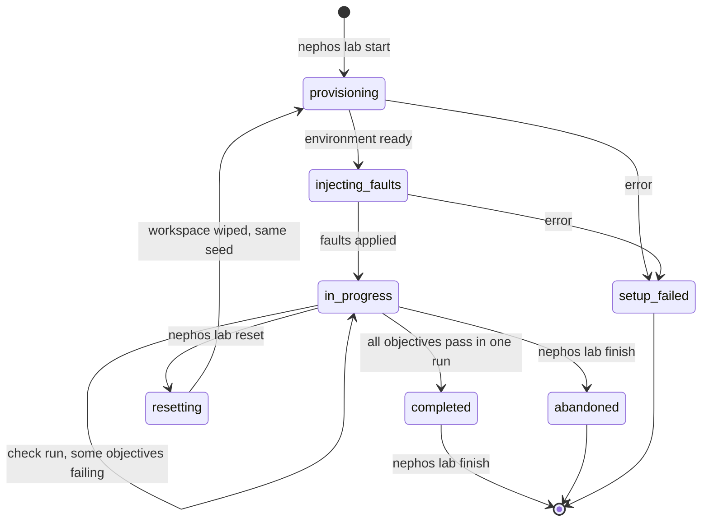

# Nephos Labs

**Status:** proposed specification (planning, September 2026). Format decision: [ADR-0010](adr/0010-lab-format-yaml-cel-probes.md). Schema version: `v1alpha1`.

A **lab** is a scenario with a goal: "your private web server can't reach the internet, fix it". Nephos builds the starting infrastructure, injects faults, lets the learner work with the CLI or console, and **verifies the result by sending real traffic**.

## Contents

1. [Principles for lab design](#1-principles-for-lab-design)
2. [Lab package layout](#2-lab-package-layout)
3. [The `lab.yaml` format](#3-the-labyaml-format)
4. [Check types](#4-check-types)
5. [The CEL environment](#5-the-cel-environment)
6. [Lab lifecycle](#6-lab-lifecycle)
7. [Authoring and testing labs](#7-authoring-and-testing-labs)
8. [Safety of checks](#8-safety-of-checks)
9. [Complete example: `nat-troubleshooting`](#9-complete-example-nat-troubleshooting)
10. [The five MVP labs](#10-the-five-mvp-labs)
11. [Future lab ideas](#11-future-lab-ideas)

---

## 1. Principles for lab design

1. **Objectives describe outcomes, not steps.** Write "app-1 can reach the internet over HTTPS", not "add a route to the NAT gateway". Any valid solution should pass.
2. **Check behavior first.** Every lab has at least one `probe`. Use `assert` for things traffic can't show, such as least privilege. Use `exec` sparingly: the learner is root and can fake local state.
3. **Close the shortcuts.** Pair each positive objective with a negative or invariant one ("app-1 still has no public IP", "the subnet still uses a custom NACL"). Otherwise "put everything in a public subnet and open all ports" wins.
4. **Don't grade names or rule numbers** unless the lab teaches them. Requirements may fix instance names so checks can find them.
5. **Hints go from concept to command.** The first hint names the idea, and the last one may give the exact fix.
6. **Every lab ends with a debrief:** what happened, why AWS behaves this way, a link to the relevant AWS documentation, and how to try it on real AWS (with a cost warning).
7. **Troubleshooting labs randomize their faults; beginner labs are deterministic.**
8. **Time boxes:** beginner labs up to 30 minutes, intermediate up to 45, capstones up to 90.

## 2. Lab package layout

Built-in labs live in `labs/` and are embedded into `nephosd`. Each lab is a directory named `NNN-<lab-id>`:

```text
labs/003-nat-troubleshooting/
├── lab.yaml          # required: metadata, environment, faults, objectives, hints, solution
├── scenario.md       # optional: long scenario text (otherwise inline in lab.yaml)
├── debrief.md        # optional: long debrief text
└── scripts/          # optional: script checks (escape hatch)
```

## 3. The `lab.yaml` format

### 3.1 Top-level structure

```yaml
schema_version: v1alpha1
kind: Lab
metadata: {}        # identity and catalog information
scenario: ""        # Markdown shown at start (or scenario_file: scenario.md)
environment: {}     # resources created before the learner starts
faults: {}          # optional mutations that break the environment
objectives: []      # what must be true to complete the lab
hints: []           # progressive help
solution: {}        # reference solution, used by `nephos lab test` and for "show solution"
debrief: ""         # Markdown shown on completion (or debrief_file: debrief.md)
```

### 3.2 `metadata`

| Field | Required | Description |
|---|---|---|
| `id` | yes | Unique kebab-case ID; must match the directory suffix |
| `title` | yes | Shown in the catalog |
| `summary` | yes | One sentence |
| `difficulty` | yes | `beginner`, `intermediate`, or `advanced` |
| `estimated_minutes` | yes | Realistic time for the target learner |
| `tags` | no | e.g. `[vpc, nat-gateway, troubleshooting]` |
| `prerequisites` | no | Lab IDs recommended beforehand |
| `requires_nephos` | yes | Version constraint, e.g. `">= 0.1.0"` |
| `version` | yes | Semantic version of the lab. Bump the minor or major version when objectives change. |
| `authors` | no | Names or handles |

### 3.3 `environment`

`environment` declares resources the lab engine creates, in dependency order, inside a fresh workspace.

- **Fields:** resources use the same fields as the API ([ADR-0008](adr/0008-rest-openapi-api-not-aws-compatible.md)), with one change: references use **names** and drop the `_id` suffix. So `vpc_id` becomes `vpc`, `subnet_id` becomes `subnet`, `vpc_security_group_ids` becomes `security_groups`, `gateway_id` becomes `gateway`, and `nat_gateway_id` becomes `nat_gateway`.
- **Special values:** `my-ip` works wherever a CIDR is expected. `route` is a resource type of its own, keyed by `route_table` + `destination_cidr_block`, like Terraform's `aws_route`.

```yaml
environment:
  default_vpc: false            # create the workspace's default VPC? (default: true)
  resources:
    - type: vpc
      name: shop
      cidr_block: 10.20.0.0/16
    - type: subnet
      name: public-a
      vpc: shop
      cidr_block: 10.20.1.0/24
      availability_zone: local-1a
      map_public_ip_on_launch: true
    - type: security_group
      name: bastion
      vpc: shop
      ingress:
        - { protocol: tcp, from_port: 22, to_port: 22, cidr_blocks: [my-ip] }
    - type: instance
      name: bastion
      subnet: public-a
      ami: ubuntu-24.04
      instance_type: t3.nano
      security_groups: [bastion]
      key_pair: lab-key
  ready:                        # gates before the learner gets control
    - { cloud_init_done: bastion }
```

Supported resource types in `v1alpha1`:

- `vpc`, `subnet`
- `internet_gateway`, `route_table`, `route`, `route_table_association`
- `elastic_ip`, `nat_gateway`
- `security_group`, `network_acl`, `network_acl_association`
- `key_pair`, `instance`

When an environment creates a key pair, the lab engine saves its private key to `~/.nephos/labs/<attempt>/<name>.pem` for the learner.

### 3.4 `faults`

Faults run after the environment is ready.

```yaml
faults:
  selection: random            # random (seeded per attempt) | all | none
  variants:
    - id: missing-default-route
      description: The private route table lost its default route.   # author-facing only
      actions:
        - delete: { type: route, route_table: private-rt, destination_cidr_block: 0.0.0.0/0 }
```

The same **action vocabulary** is used by `faults` and `solution`:

| Action | Example |
|---|---|
| `create` | `create: { type: route, route_table: private-rt, destination_cidr_block: 0.0.0.0/0, nat_gateway: shop-nat }` |
| `update` | `update: { type: route, route_table: private-rt, destination_cidr_block: 0.0.0.0/0, set: { nat_gateway: shop-nat-2 } }` |
| `delete` | `delete: { type: nat_gateway, name: shop-nat }` |
| `exec` | `exec: { instance: app-1, command: ["systemctl", "stop", "nginx"] }` |
| `wait` | `wait: { for: available, type: nat_gateway, name: shop-nat, timeout: 60s }` |

The selected variant and the random seed are recorded on the lab attempt. `nephos lab reset` rebuilds the same scenario; `nephos lab start --variant <id>` forces a variant.

### 3.5 `objectives`

```yaml
objectives:
  - id: app-reaches-internet
    title: app-1 can reach the internet over HTTPS
    initially: fail            # fail | pass | any: what `nephos lab test` expects before the solution
    check:
      probe: { from: { instance: app-1 }, to: internet, port: tcp/443, expect: reachable, stable_for: 5s }
```

- `initially: fail` marks what the learner must fix.
- `initially: pass` marks invariants the learner must not break (the anti-shortcut objectives).
- The lab is **completed** when every objective passes in the same check run.

### 3.6 `hints` and `solution`

```yaml
hints:
  - text: Which route table does app-1's subnet use, and where does its default route point?
  - objective: app-reaches-internet          # optional link to an objective
    text: A NAT gateway forwards using the route table of the subnet it lives in.
  - text: "Try: nephos explain --from app-1 --to internet --port tcp/443"

solution:
  default: []                                # actions applied for any variant without its own entry
  variants:
    missing-default-route:
      - create: { type: route, route_table: private-rt, destination_cidr_block: 0.0.0.0/0, nat_gateway: shop-nat }
```

Hints are revealed one at a time with `nephos lab hint` or the console. Hint usage is recorded, but never blocks completion.

## 4. Check types

Every check accepts an optional `description` (shown to the learner) and a `timeout`.

### 4.1 `probe`: real traffic

```yaml
probe:
  from: internet                       # internet (alias: my-ip) | { instance: <name> }
  to: { instance: web-1, address: public }   # { instance, address: private|public } | { ip } | { dns } | internet
  port: tcp/80                         # tcp/<port> | udp/<port> | icmp
  http: { path: /, status: 200, body_contains: "Welcome to nginx" }   # optional, for HTTP on a TCP port
  expect: reachable                    # reachable | not_reachable | refused | timeout
  stable_for: 5s                       # must hold continuously (re-probed every second)
  timeout: 3s                          # per attempt
```

- `not_reachable` matches `refused`, `timeout`, or `unreachable`.
- `to: internet` targets the simulated endpoint `echo.nephos.test` (198.51.100.80), so checks work offline.
- Probes from an instance open their socket inside the instance's network namespace, so the instance's own firewall applies. The learner cannot tamper with the probe itself ([ARCHITECTURE §8.1](ARCHITECTURE.md#81-probe-live)).

### 4.2 `assert`: CEL over the resource graph

```yaml
assert:
  expr: instance('app-1').public_ip == null
  message: app-1 must not have a public IP address
```

The expression must return a boolean. Errors, such as a resource that doesn't exist, count as a failure and show the error message. See [§5](#5-the-cel-environment).

### 4.3 `exec`: a command inside an instance

```yaml
exec:
  instance: web-1
  command: ["systemctl", "is-active", "nginx"]
  expect: { exit_code: 0, stdout_contains: active }
  timeout: 10s
```

Runs as root through the console channel, bypassing the network. Use it for instance-internal state that no probe can observe.

### 4.4 `script`: escape hatch

```yaml
script:
  path: scripts/check-something.sh
  timeout: 30s
```

- Exit code 0 means pass. The first line of stdout becomes the message.
- Runs in a sandbox ([§8](#8-safety-of-checks)) with the `nephos` CLI, `NEPHOS_WORKSPACE`, and a read-only token scoped to the lab workspace.
- Built-in MVP labs may use at most one script check in total.

### 4.5 Combinators

```yaml
all: [ <check>, <check> ]     # every check passes
any: [ <check>, <check> ]     # at least one passes
not: <check>                  # the check fails
```

## 5. The CEL environment

Assertions use [CEL](https://cel.dev) (`cel-go`): side-effect free, not Turing-complete, and cost-limited. Expressions are compiled and type-checked by `nephos lab validate`.

**Data**

- `workspace`: an object with lists `vpcs`, `subnets`, `route_tables`, `internet_gateways`, `nat_gateways`, `elastic_ips`, `security_groups`, `network_acls`, `instances`, and `key_pairs`.
- Resource objects carry their API fields.

**Lookups** return the named resource or raise "not found":

`vpc(name)`, `subnet(name)`, `route_table(name)`, `internet_gateway(name)`, `nat_gateway(name)`, `elastic_ip(name)`, `security_group(name)`, `network_acl(name)`, `instance(name)`.

**Relationship helpers**

| Helper | Returns |
|---|---|
| `subnet_of(instance)` | The instance's subnet |
| `security_groups_of(instance)` | The security groups attached to its primary ENI |
| `route_table_for(subnet)` | The explicitly associated route table, or the VPC's main route table |
| `network_acl_for(subnet)` | The associated network ACL (`is_default` tells whether it's the default one) |
| `route_lookup(route_table, ip)` | The longest-prefix route for an IP: `destination_cidr_block`, `target {type, name, id}`, `state` (`active` or `blackhole`) |
| `is_public_subnet(subnet)` | True if its route table sends 0.0.0.0/0 to an attached internet gateway |

**Semantic helpers.** These share their implementation with enforcement and `explain`, so they can't disagree with the data plane.

| Helper | Returns |
|---|---|
| `sg_allows_ingress(target, protocol, port, source)` | `target` is a security group or an instance. `source` is a CIDR string, `'my-ip'`, or a security group. True if any rule admits the entire source. |
| `sg_allows_egress(target, protocol, port, destination)` | Same, for egress |
| `nacl_allows(nacl, direction, protocol, port, cidr)` | Evaluates NACL rules in rule-number order |
| `explain(from, to, port)` | `{verdict: 'allowed' or 'blocked', blocked_by: {kind, name, id, rule}}`. `from` and `to` are instances or `'internet'`. |

**Examples**

```cel
subnet('private-a').map_public_ip_on_launch == false

route_lookup(route_table_for(subnet_of(instance('app-1'))), '198.51.100.80').target.type == 'nat_gateway'

is_public_subnet(subnet(nat_gateway('shop-nat').subnet))

!sg_allows_ingress(instance('web-1'), 'tcp', 22, '0.0.0.0/0')

sg_allows_ingress(security_group('api'), 'tcp', 8080, security_group('web'))

workspace.security_groups.all(sg, !sg_allows_ingress(sg, 'tcp', 22, '0.0.0.0/0'))

explain('internet', instance('app-1'), 'tcp/22').verdict == 'blocked'
```

The CEL bindings extension is enabled, so `cel.bind(name, value, expr)` can name an intermediate result ([§9](#9-complete-example-nat-troubleshooting) shows it in use).

## 6. Lab lifecycle

### 6.1 Attempts and workspaces

`nephos lab start <id>` does four things:

1. Creates an **attempt** (ID, random seed, selected fault variant).
2. Creates a dedicated workspace `lab-<id>-<n>`.
3. Switches the CLI to that workspace.
4. Opens the lab panel in the console.

Labs never touch the learner's other workspaces.



### 6.2 When checks run

- **On demand:** `nephos lab check`, or "Check now" in the console.
- **Automatically:**
  - 3 seconds after the last resource change in the lab workspace (debounced);
  - every 30 seconds while the attempt is `in_progress`, to catch changes made *inside* instances (for example, starting nginx).
- **Results:** each check run records pass, fail, or error per objective, with a message and a duration. The first time an objective passes is kept for progress display.
- **Completion:** all objectives must pass in the **same** run. The attempt then moves to `completed` and the debrief is shown.

### 6.3 Commands

| Command | Purpose |
|---|---|
| `nephos lab list` / `nephos lab show <id>` | Browse the catalog |
| `nephos lab start <id> [--variant <v>]` | Start an attempt |
| `nephos lab status` | Objectives and their latest results |
| `nephos lab check` | Run checks now |
| `nephos lab hint` | Reveal the next hint |
| `nephos lab solution` | Reveal the reference solution (asks for confirmation; recorded) |
| `nephos lab reset` | Rebuild the scenario with the same seed |
| `nephos lab finish` | End the attempt, delete its workspace, switch back |
| `nephos lab progress [--export json]` | History of attempts, hints used, completion times |
| `nephos lab new <id>` | Scaffold a new lab directory |
| `nephos lab validate <dir>` / `nephos lab test <dir>` | Authoring tools ([§7](#7-authoring-and-testing-labs)) |

### 6.4 Progress storage

Progress lives in SQLite, in `lab_attempts`, `lab_check_runs`, `lab_objective_results`, and `lab_hint_reveals`, and is exportable as JSON. Classroom features (M15) will add users and instructor exports on top of these tables without changing them.

## 7. Authoring and testing labs

### 7.1 Workflow

1. Scaffold the lab with `nephos lab new <id>`, then write `lab.yaml`, the scenario, and the debrief.
2. Validate it with `nephos lab validate labs/NNN-<id>`.
3. Play-test it with `nephos lab start --from-dir labs/NNN-<id>`.
4. Test it with `nephos lab test labs/NNN-<id>`. Add `--variant <v>` to run one variant, or `--keep` to leave the workspace for debugging.
5. Open a pull request. CI runs validation and tests.

### 7.2 What `nephos lab validate` checks

- The document matches the `v1alpha1` JSON Schema.
- `metadata.id` matches the directory name.
- Every name reference in `environment`, `faults`, and `solution` resolves.
- Every CEL expression compiles, type-checks, and stays under the cost limit.
- Every objective has a check. Every fault variant is covered by `solution.default` or its own entry.
- Every `hints[].objective` exists. Referenced Markdown and script files exist.
- There is at least one `probe` among the objectives.

### 7.3 What `nephos lab test` does

For each fault variant (or once, if there are no faults), in its own workspace:

1. Apply `environment` and wait for the `ready` gates.
2. Apply the variant's fault actions.
3. Run all checks. Every `initially: fail` objective must fail, and every `initially: pass` objective must pass.
4. Apply the solution actions.
5. Run all checks until every objective passes (default timeout 120 s). Confirm the attempt reaches `completed`.
6. Finish the attempt and run the leak checker ([ARCHITECTURE §7](ARCHITECTURE.md#7-state-reconciliation-and-reset)).

The command reports timings per step so slow labs are visible.

### 7.4 CI rules

- `nephos lab validate` runs for every lab on every pull request.
- `nephos lab test` runs for every lab on pull requests that touch `labs/`, `internal/network/`, `internal/compute/`, `internal/labs/`, or `images/`, and nightly.
- A lab whose objectives change must bump `metadata.version`.

**Review checklist for lab pull requests:**

- [ ] Objectives describe outcomes, and any valid solution passes.
- [ ] Shortcuts are closed with `initially: pass` invariants or constraint asserts.
- [ ] Hints go from concept to concrete command.
- [ ] The debrief links to the matching AWS documentation and warns about real-AWS costs.
- [ ] The time estimate was measured by someone other than the author.

## 8. Safety of checks

- Checks use a **read-only token scoped to the lab workspace**.
- `probe` and `assert` have no side effects.
- `exec` runs only in the lab workspace's instances.
- `script` checks run in an isolated helper container inside the appliance with:
  - the lab directory mounted read-only;
  - no network access except the API socket;
  - CPU, memory, and time limits.
- Only **built-in** labs are available in the MVP. External lab catalogs (M15) will require signature verification and an explicit trust prompt.

## 9. Complete example: `nat-troubleshooting`

`labs/003-nat-troubleshooting/lab.yaml`:

```yaml
schema_version: v1alpha1
kind: Lab

metadata:
  id: nat-troubleshooting
  title: The private server can't reach the internet
  summary: A private instance lost its path to the internet. Find out why and fix it without exposing it.
  difficulty: intermediate
  estimated_minutes: 25
  tags: [vpc, nat-gateway, route-tables, troubleshooting]
  prerequisites: [custom-vpc]
  requires_nephos: ">= 0.1.0"
  version: 1.0.0
  authors: [Nephos maintainers]

scenario: |
  The shop's order service runs on **app-1** in a private subnet. This morning its security
  updates started failing: `apt update` just hangs. Nobody admits to changing anything.

  Restore app-1's outbound internet access. app-1 must stay private: no public IP and no direct
  route from the internet. You can reach app-1 through **bastion** (key: `lab-key`).

environment:
  default_vpc: false
  resources:
    - { type: key_pair, name: lab-key }
    - { type: vpc, name: shop, cidr_block: 10.20.0.0/16 }
    - { type: subnet, name: public-a, vpc: shop, cidr_block: 10.20.1.0/24, availability_zone: local-1a, map_public_ip_on_launch: true }
    - { type: subnet, name: private-a, vpc: shop, cidr_block: 10.20.2.0/24, availability_zone: local-1a }
    - { type: internet_gateway, name: shop-igw, vpc: shop }
    - { type: route_table, name: public-rt, vpc: shop }
    - { type: route, route_table: public-rt, destination_cidr_block: 0.0.0.0/0, gateway: shop-igw }
    - { type: route_table_association, route_table: public-rt, subnet: public-a }
    - { type: elastic_ip, name: nat-eip }
    - { type: nat_gateway, name: shop-nat, subnet: public-a, elastic_ip: nat-eip }
    - { type: route_table, name: private-rt, vpc: shop }
    - { type: route, route_table: private-rt, destination_cidr_block: 0.0.0.0/0, nat_gateway: shop-nat }
    - { type: route_table_association, route_table: private-rt, subnet: private-a }
    - type: security_group
      name: bastion
      vpc: shop
      ingress:
        - { protocol: tcp, from_port: 22, to_port: 22, cidr_blocks: [my-ip] }
    - type: security_group
      name: app
      vpc: shop
      ingress:
        - { protocol: tcp, from_port: 22, to_port: 22, security_groups: [bastion] }
    - { type: instance, name: bastion, subnet: public-a, ami: ubuntu-24.04, instance_type: t3.nano, security_groups: [bastion], key_pair: lab-key }
    - { type: instance, name: app-1, subnet: private-a, ami: ubuntu-24.04, instance_type: t3.micro, security_groups: [app], key_pair: lab-key }
  ready:
    - { cloud_init_done: bastion }
    - { cloud_init_done: app-1 }

faults:
  selection: random
  variants:
    - id: missing-default-route
      description: private-rt lost its default route.
      actions:
        - delete: { type: route, route_table: private-rt, destination_cidr_block: 0.0.0.0/0 }

    - id: nat-in-private-subnet
      description: The NAT gateway was recreated in the private subnet.
      actions:
        - delete: { type: nat_gateway, name: shop-nat }
        - wait: { for: deleted, type: nat_gateway, name: shop-nat, timeout: 60s }
        - create: { type: nat_gateway, name: shop-nat-private, subnet: private-a, elastic_ip: nat-eip }
        - update: { type: route, route_table: private-rt, destination_cidr_block: 0.0.0.0/0, set: { nat_gateway: shop-nat-private } }

    - id: public-route-lost
      description: public-rt lost its route to the internet gateway (this also breaks SSH to bastion).
      actions:
        - delete: { type: route, route_table: public-rt, destination_cidr_block: 0.0.0.0/0 }

    - id: nat-gateway-deleted
      description: The NAT gateway was deleted; the private default route is now a blackhole.
      actions:
        - delete: { type: nat_gateway, name: shop-nat }

objectives:
  - id: app-reaches-internet
    title: app-1 can reach the internet over HTTPS
    initially: fail
    check:
      probe: { from: { instance: app-1 }, to: internet, port: tcp/443, expect: reachable, stable_for: 5s }

  - id: egress-uses-public-nat
    title: app-1's default route points to a NAT gateway in a public subnet
    initially: fail
    check:
      assert:
        expr: >
          cel.bind(r, route_lookup(route_table_for(subnet_of(instance('app-1'))), '198.51.100.80'),
            r.state == 'active' && r.target.type == 'nat_gateway' &&
            is_public_subnet(subnet(nat_gateway(r.target.name).subnet)))
        message: app-1's route to the internet must use an available NAT gateway that lives in a public subnet.

  - id: app-stays-private
    title: app-1 is still private
    initially: pass
    check:
      all:
        - assert:
            expr: instance('app-1').public_ip == null
            message: app-1 must not have a public IP address.
        - assert:
            expr: "!is_public_subnet(subnet_of(instance('app-1')))"
            message: app-1's subnet must not route directly to an internet gateway.

  - id: bastion-reachable
    title: bastion accepts SSH from your IP
    initially: any
    check:
      probe: { from: internet, to: { instance: bastion, address: public }, port: tcp/22, expect: reachable }

hints:
  - text: Start at app-1 and follow the packet. Which route table does its subnet use, and where does 0.0.0.0/0 point?
  - text: A route whose target no longer exists stays in the table with state `blackhole`.
  - objective: egress-uses-public-nat
    text: A NAT gateway forwards traffic using the route table of the subnet *it* lives in, so that subnet needs a route to an internet gateway.
  - text: "Let Nephos trace it for you: nephos explain --from app-1 --to internet --port tcp/443"

solution:
  variants:
    missing-default-route:
      - create: { type: route, route_table: private-rt, destination_cidr_block: 0.0.0.0/0, nat_gateway: shop-nat }
    nat-in-private-subnet:
      - create: { type: elastic_ip, name: nat-eip-2 }
      - create: { type: nat_gateway, name: shop-nat-public, subnet: public-a, elastic_ip: nat-eip-2 }
      - wait: { for: available, type: nat_gateway, name: shop-nat-public, timeout: 60s }
      - update: { type: route, route_table: private-rt, destination_cidr_block: 0.0.0.0/0, set: { nat_gateway: shop-nat-public } }
      - delete: { type: nat_gateway, name: shop-nat-private }
    public-route-lost:
      - create: { type: route, route_table: public-rt, destination_cidr_block: 0.0.0.0/0, gateway: shop-igw }
    nat-gateway-deleted:
      - create: { type: nat_gateway, name: shop-nat-2, subnet: public-a, elastic_ip: nat-eip }
      - wait: { for: available, type: nat_gateway, name: shop-nat-2, timeout: 60s }
      - update: { type: route, route_table: private-rt, destination_cidr_block: 0.0.0.0/0, set: { nat_gateway: shop-nat-2 } }

debrief: |
  ## What happened
  Private instances reach the internet through a **NAT gateway**, and that path has three links:
  the private subnet's route table sends 0.0.0.0/0 to the NAT gateway; the NAT gateway is `available`;
  and the NAT gateway's **own** subnet routes 0.0.0.0/0 to an internet gateway. Your scenario broke one link.

  ## Why AWS works this way
  A NAT gateway is a network interface in a subnet. It rewrites the source address, then hands the
  packet back to the VPC router like any other interface, so its subnet's route table decides what
  happens next. Deleting a route's target leaves a `blackhole` route behind instead of removing it.

  ## On real AWS
  - [NAT gateways](https://docs.aws.amazon.com/vpc/latest/userguide/vpc-nat-gateway.html)
  - [Route tables](https://docs.aws.amazon.com/vpc/latest/userguide/VPC_Route_Tables.html)
  - NAT gateways are billed per hour and per GB processed. Delete them when you finish experimenting.
```

Notes on this example:

- The fault variants cover four real-world causes of the same symptom. The learner can't pattern-match: they must diagnose.
- `app-stays-private` blocks the shortcut of giving app-1 a public IP or routing its subnet to the internet gateway.
- `bastion-reachable` is `initially: any` because the `public-route-lost` variant breaks it, and every solution must restore it.

## 10. The five MVP labs

The labs form a path. Each one adds concepts, and together they cover every MVP networking feature: VPCs, subnets, route tables, internet gateways, public and Elastic IPs, NAT gateways, security groups, network ACLs, key pairs, user data, and `explain`.

| # | Lab ID | Title | Level | Time | Core concepts |
|---|---|---|---|---|---|
| 1 | `first-instance` | Hello, cloud: your first web server | Beginner | 20 min | AMI, instance type, key pair, security group, public IP, user data |
| 2 | `custom-vpc` | Build a VPC from scratch | Beginner | 40 min | CIDR planning, subnets, internet gateway, route tables, bastion, SG references |
| 3 | `nat-troubleshooting` | The private server can't reach the internet | Intermediate | 25 min | NAT gateway placement, blackhole routes, `explain` |
| 4 | `stateless-trap` | Security groups vs network ACLs | Intermediate | 30 min | Stateful vs stateless, ephemeral ports, rule order, least privilege |
| 5 | `capstone-two-tier` | Ship it: a production-shaped network | Intermediate | 75 min | Multi-AZ design, tiers, least privilege, end-to-end verification |

### Lab 1: `first-instance`: Hello, cloud: your first web server

- **Story:** You've just been given a fresh (simulated) cloud account. Put a web page online that your team can see, without leaving the server open to the world.
- **Environment:** the workspace default VPC only (172.31.0.0/16, public default subnets).
- **Faults:** none (a deterministic guided lab).
- **Guided steps (in the scenario text):**
  1. Create a key pair.
  2. Create security group `web`: HTTP from anywhere, SSH from **My IP**.
  3. Launch `web-1` (Ubuntu 24.04, `t3.micro`) with user data that installs nginx.
  4. Open the page through the console preview.
  5. SSH in and read `/var/log/cloud-init-output.log`.
- **Objectives:**

  | ID | Initially | Check |
  |---|---|---|
  | `web-running` | fail | `assert`: `instance('web-1').state == 'running'` |
  | `http-from-internet` | fail | `probe` internet → `web-1` public, `tcp/80`, `http.status: 200`, `body_contains: nginx`, stable 5 s |
  | `ssh-from-my-ip` | fail | `probe` internet → `web-1` public, `tcp/22`, reachable |
  | `ssh-not-open-to-world` | any | `assert`: `!sg_allows_ingress(instance('web-1'), 'tcp', 22, '0.0.0.0/0')` |

- **Hints:** new security groups allow no inbound traffic; the **My IP** option; a user-data script example; where cloud-init logs its output.
- **Debrief:** what an AMI and an instance type are; key pairs, and why AWS never stores your private key; why security groups are default-deny inbound but let responses out (statefulness); how a default subnet gives public IPs; why SSH should never be open to 0.0.0.0/0.

### Lab 2: `custom-vpc`: Build a VPC from scratch

- **Story:** The team needs its own network: a public entry point and a private tier nobody on the internet can reach directly.
- **Environment:** empty workspace (`default_vpc: false`).
- **Faults:** none.
- **Requirements given to the learner:**
  - VPC `10.0.0.0/16`.
  - Public subnet `10.0.1.0/24` and private subnet `10.0.2.0/24` in `local-1a`.
  - An internet gateway.
  - A bastion instance named `bastion` in the public subnet, reachable over SSH from My IP.
  - An instance named `app` in the private subnet with no public IP, reachable over SSH only from the bastion.
- **Objectives:**

  | ID | Initially | Check |
  |---|---|---|
  | `vpc-exists` | fail | `assert`: `workspace.vpcs.exists(v, v.cidr_block == '10.0.0.0/16')` |
  | `bastion-ssh` | fail | `probe` internet → `bastion` public, `tcp/22`, reachable |
  | `app-private` | fail | `assert`: `instance('app').public_ip == null && !is_public_subnet(subnet_of(instance('app')))` |
  | `bastion-to-app` | fail | `probe` `bastion` → `app` private, `tcp/22`, reachable |
  | `app-ssh-least-privilege` | fail | `assert`: `!sg_allows_ingress(instance('app'), 'tcp', 22, '0.0.0.0/0')` |
  | `app-not-from-internet` | fail | `assert`: `explain('internet', instance('app'), 'tcp/22').verdict == 'blocked'` (`app` has no public address, so this is a static check) |

- **Hints:**
  - the 5 reserved addresses per subnet;
  - attaching an internet gateway isn't enough without a route;
  - the main route table trap (adding the internet route there makes *every* unassociated subnet public);
  - `map_public_ip_on_launch`;
  - reaching `app` through the bastion with `ssh -J`.
- **Debrief:** CIDR planning; reserved IPs; what makes a subnet "public" (only its route table); the main route table; the bastion pattern and `ProxyJump`; referencing the bastion's security group instead of an IP.

### Lab 3: `nat-troubleshooting`: The private server can't reach the internet

Fully specified in [§9](#9-complete-example-nat-troubleshooting).

- **Four randomized faults:** missing default route; NAT gateway in the private subnet; public route table lost its internet gateway route; NAT gateway deleted (blackhole route).
- **Objectives:** outbound HTTPS from `app-1` works; the default route uses a NAT gateway in a public subnet; `app-1` stays private; the bastion stays reachable.

### Lab 4: `stateless-trap`: Security groups vs network ACLs

- **Story:** A colleague "hardened" the API subnet with a network ACL. Now the web tier can't talk to the API, and the API's security group is still wide open. Fix connectivity *and* tighten access.
- **Environment:**
  - VPC `store` (10.30.0.0/16), public subnet `web-a` (10.30.1.0/24), private subnet `app-a` (10.30.2.0/24), internet gateway.
  - `web-1` in `web-a` with security group `web` (HTTP from anywhere, SSH from My IP).
  - `api-1` in `app-a`, serving HTTP on 8080 through user data, with security group `api` allowing 8080 from **0.0.0.0/0**.
  - Custom network ACL `app-nacl` on `app-a`: inbound rule 100 allows tcp 8080 from 10.30.1.0/24; inbound rule 110 allows tcp 22 from 10.30.1.0/24.
- **Faults (random):**
  - `outbound-only-service-port`: outbound rule 100 allows only tcp **8080** to 10.30.1.0/24, so responses to ephemeral ports are dropped.
  - `deny-before-allow`: outbound rule 100 allows tcp 1024–65535 to 10.30.1.0/24, but rule **90** denies tcp 32768–60999 ("block high ports"), and lower numbers win.
- **Objectives:**

  | ID | Initially | Check |
  |---|---|---|
  | `web-to-api` | fail | `probe` `web-1` → `api-1` private, `tcp/8080`, reachable, stable 5 s |
  | `api-sg-least-privilege` | fail | `assert`: `!sg_allows_ingress(security_group('api'), 'tcp', 8080, '0.0.0.0/0') && sg_allows_ingress(security_group('api'), 'tcp', 8080, security_group('web'))` |
  | `api-stays-private` | pass | `assert`: `instance('api-1').public_ip == null` |
  | `nacl-still-custom` | pass | `assert`: `!network_acl_for(subnet('app-a')).is_default` |
  | `nacl-not-wide-open` | pass | `assert`: `!nacl_allows(network_acl_for(subnet('app-a')), 'inbound', 'tcp', 22, '0.0.0.0/0')` |

- **Hints:**
  - security groups remember connections, NACLs don't;
  - which port does the *response* use? (Linux clients use 32768–60999; AWS recommends allowing 1024–65535);
  - NACL rules are evaluated from the lowest number, and the first match wins;
  - allow traffic from a security group instead of a CIDR.
- **Debrief:** a stateful vs stateless comparison table; ephemeral port ranges by operating system; when NACLs are worth it (coarse subnet-level guardrails, explicit denies) and when security groups alone suffice; security group chaining.

### Lab 5: `capstone-two-tier`: Ship it: a production-shaped network

- **Story:** Launch day. Build the network for a two-tier app across two availability zones, prove it works, and prove it's locked down.
- **Environment:** empty workspace (`default_vpc: false`).
- **Faults:** none. This is an open-ended build; the reference solution creates the full design.
- **Requirements given to the learner:**
  - One VPC with public and private subnets in `local-1a` **and** `local-1b`.
  - An internet gateway, and at least one NAT gateway.
  - Instances `bastion`; `web-1` and `web-2` (public, HTTP on 80, different AZs); `app-1` and `app-2` (private, HTTP on 8080, different AZs).
  - SSH only through the bastion; the app tier accepts 8080 only from the web tier; private instances reach the internet through NAT.
- **Objectives (a connectivity matrix plus constraints):**

  | ID | Initially | Check |
  |---|---|---|
  | `web-public` | fail | `probe` internet → `web-1` and `web-2` public, `tcp/80`, HTTP 200 (combined with `all`) |
  | `bastion-entry` | fail | `probe` internet → `bastion` public, `tcp/22`, reachable |
  | `no-direct-ssh-to-web` | fail | `probe` internet → `web-1` public, `tcp/22`, `not_reachable` (plus existence of `web-1`) |
  | `bastion-to-apps` | fail | `probe` `bastion` → `app-1` and `app-2`, `tcp/22`, reachable |
  | `web-to-app-cross-az` | fail | `probe` `web-1` → `app-2` and `web-2` → `app-1`, `tcp/8080`, reachable |
  | `app-tier-isolated` | fail | `probe` `bastion` → `app-1`, `tcp/8080`, `not_reachable` |
  | `apps-private` | fail | `assert`: both app instances have no public IP and sit in non-public subnets |
  | `apps-reach-internet` | fail | `probe` `app-1` and `app-2` → internet, `tcp/443`, reachable |
  | `multi-az` | fail | `assert`: `subnet_of(instance('web-1')).availability_zone != subnet_of(instance('web-2')).availability_zone`, and the same for app-1 and app-2 |
  | `no-world-ssh` | fail | `assert`: `workspace.security_groups.all(sg, !sg_allows_ingress(sg, 'tcp', 22, '0.0.0.0/0'))` |

- **Hints:** sketch the design on paper first; build and verify layer by layer; `nephos explain` for every failing row of the matrix.
- **Debrief:**
  - why multi-AZ matters;
  - one NAT gateway versus one per AZ (cost against resilience);
  - security group chaining as architecture documentation;
  - what a load balancer would change (preview of the M10 lab);
  - challenge: rebuild the design with Terraform once the provider ships (M9).

## 11. Future lab ideas

Each idea is tied to the milestone that makes it possible ([ROADMAP](ROADMAP.md)):

| Lab idea | Teaches | Needs |
|---|---|---|
| `locked-out` | A security group change plus a `ufw` rule lock you out; recover through the serial console | MVP |
| `imds-hardening` | IMDSv1 vs IMDSv2 and why SSRF matters; require tokens without breaking the app | MVP |
| `elastic-ip-failover` | Move an Elastic IP to a standby instance | MVP |
| `dns-hostnames` | `enable_dns_support` / `enable_dns_hostnames` troubleshooting | MVP |
| `nat-instance` | Build a NAT instance by disabling source/dest check; compare with a NAT gateway | Route to ENI targets |
| `terraform-rebuild` | Recreate lab 5 with Terraform; destroy and rebuild | M9 |
| `load-balanced-web` | Target groups, health checks, internet-facing vs internal load balancers | M10 |
| `flow-logs-detective` | Find the blocked flow using flow log records | M11 |
| `attach-a-volume` | Attach, format, and mount a volume; survive stop/start | M12 |
| `private-bucket-access` | Reach object storage from a private subnet through a gateway endpoint | M13 |
| `peering-is-not-transitive` | Three VPCs, two peerings, one surprise | M14 |
