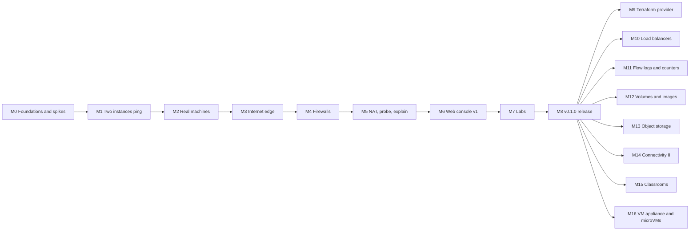

# Nephos Roadmap

**Status:** planning (September 2026). The MVP is **v0.1.0 = milestones M0–M8**.

## How this roadmap works

- **Vertical slices.** Every milestone runs end to end and ends with a demo script anyone can replay. No "backend now, UI later" milestones for core features.
- **Acceptance criteria are checkboxes.** A milestone is done when every box passes in CI, or in the manual QA the box names.
- **Behavior is pinned by tests.** Network features add connectivity-matrix cases. From M7 on, learning features also ship with a lab that uses them.
- **Spikes before commitments.** M0 validates the riskiest assumptions. If a spike fails, a superseding ADR records the fallback before M1 starts.
- **Effort is in focused hours** for one experienced developer working 20+ hours a week. Ranges, not promises. MVP total ≈ **445–545 hours**, about 4.5–6 months at 25 hours a week.
- **Scope guard.** Anything not listed goes to the [backlog](#backlog). [Non-goals](VISION.md#5-non-goals) stay non-goals.

## Overview



| Milestone | Theme | One-line demo | Effort (h) |
|---|---|---|---|
| **M0** | Foundations and spikes | Spike reports prove nested system containers and the routed VPC design work | 30–40 |
| **M1** | Thinnest end-to-end slice | Two instances in different subnets ping each other; reset leaves nothing behind | 45–55 |
| **M2** | Real machines | Launch with user data that installs nginx; curl it by private DNS name | 45–55 |
| **M3** | Internet edge | `ssh ubuntu@203.0.113.10` works; delete the IGW route and it stops working | 50–60 |
| **M4** | Firewalls | Security groups and NACLs block real traffic; the stateless trap reproduces | 50–60 |
| **M5** | NAT, probe, explain | `nephos explain` names the route table that breaks NAT egress | 50–60 |
| **M6** | Web console v1 | Launch a web server and see it on the live topology map, all in the browser | 70–85 |
| **M7** | Labs | Five labs pass automated tests; testers complete them unaided | 60–75 |
| **M8** | v0.1.0 release | Install to first SSH session in under 10 minutes on Linux, Windows, and macOS | 45–55 |

## Definition of done (every milestone)

- [ ] Code and tests merged; CI green.
- [ ] Docs updated. For network behavior changes, that includes the fidelity table in [ARCHITECTURE §5.5](ARCHITECTURE.md#55-aws-fidelity-and-known-deviations).
- [ ] A superseding ADR for any changed decision.
- [ ] The demo script committed as `docs/demos/M<n>.md` and replayable.
- [ ] A CHANGELOG entry.

---

## M0: Foundations and spikes

**Goal:** a repository others can contribute to, plus evidence that the riskiest assumptions hold ([RISKS](RISKS.md) T1, T2, T8, T10).

**Scope:**

- **Repository scaffold:**
  - Go module, `Makefile`, `golangci-lint`, `.editorconfig`, `.gitattributes` (LF line endings).
  - `LICENSE` (Apache-2.0 text from apache.org), `NOTICE`.
  - `CONTRIBUTING.md` (with DCO sign-off), `SECURITY.md`, `CODE_OF_CONDUCT.md`, issue templates.
- **CI skeleton:** lint, unit tests, CGO-disabled cross-builds (linux, darwin, and windows on amd64 and arm64), DCO check.
- **Development guide:** WSL2 + Docker Desktop, with the repository on the WSL ext4 filesystem; also native Linux.
- **Spikes.** Throwaway code on `spike/*` branches; reports in `docs/spikes/`:
  - **SP1, appliance + nested system container:** a privileged appliance running Podman boots an Ubuntu 24.04 system container (systemd, sshd, `userns=auto`). Measure boot-to-sshd time and idle memory for 20 instances. Validates [ADR-0003](adr/0003-appliance-container-packaging.md) and [ADR-0004](adr/0004-instances-as-system-containers.md).
  - **SP2, ENI plumbing:** an OCI `createRuntime` hook moves a veth into the instance's network namespace before PID 1 starts. The namespace is owned by the instance's user namespace, so instance root can add a firewall rule. Stop/start re-plumbs correctly. Validates [ADR-0004](adr/0004-instances-as-system-containers.md).
  - **SP3, routed VPC:** two VPC namespaces with overlapping CIDRs; proxy ARP and policy routing; an SG/NACL ruleset applied atomically; IGW 1:1 NAT to an edge namespace; Go opens a listener inside a namespace. Validates [ADR-0005](adr/0005-nephos-owned-routed-network-plane.md) and [ADR-0002](adr/0002-go-for-control-plane-and-cli.md).
  - **SP4, cloud-init:** the Ec2 datasource reads user data and an SSH key from a fake metadata service inside a namespace.

**Out of scope:** API, CLI, database.

**Demo:** the spike reports with their measurements, plus a terminal recording of SP3 showing an SG rule change blocking and then allowing traffic.

**Acceptance criteria:**

- [ ] CI is green on a real (small) Go module: lint, unit tests, cross-builds for all six targets.
- [ ] Reports for SP1–SP4 in `docs/spikes/`, each marking pass or fail against the validation criteria in ADR-0003, ADR-0004, and ADR-0005.
- [ ] All spikes pass on Ubuntu 24.04 (native Docker) **and** on Windows 10 with WSL2 and Docker Desktop, or superseding ADRs record the fallbacks.
- [ ] SP1 records median boot-to-sshd time and idle memory per instance.

**Effort:** 30–40 h

## M1: Thinnest end-to-end slice: two instances ping

**Goal:** the whole architecture exists end to end, in its smallest form.

**Scope:**

- `nephos up`, `down`, `status` (fixed resource flags); appliance image v0 (`nephosd`, Podman, `nephos-hook`); API token bootstrap.
- **`nephosd`:**
  - SQLite store with migrations, and the reconcile framework.
  - OpenAPI v1 skeleton: `vpcs`, `subnets`, `instances` (run, list, describe, terminate), `/v1/health`, `/v1/events`.
- **Resource services:** CIDR validation, reserved addresses, IPAM, AWS-style IDs, unique names.
- **Network engine:** VPC namespaces, subnet gateway addresses, ENI veth pairs with proxy ARP and /32 routes, the local route. No security groups exist yet, so none are exposed or implied.
- **Compute engine:** Podman client; a locally built `ubuntu-24.04` development AMI; a single fixed instance type, `t3.micro`.
- `nephos console <instance> [-- command]` (exec).
- `nephos reset` with the leak checker, and `nephos reset --hard`.
- An e2e test harness running in CI.

**Out of scope:** SSH, key pairs, internet access, firewalls, DNS, console UI.

**Demo:**

```bash
nephos up
nephos vpc create lab --cidr-block 10.0.0.0/16
nephos subnet create a --vpc lab --cidr-block 10.0.1.0/24 --availability-zone local-1a
nephos subnet create b --vpc lab --cidr-block 10.0.2.0/24 --availability-zone local-1b
nephos instance run one --subnet a --wait
nephos instance run two --subnet b --wait
nephos console one -- ping -c 3 10.0.2.4     # .4 is the first assignable address (.0-.3 are reserved)
nephos down && nephos up
nephos console one -- ping -c 3 10.0.2.4     # state and addresses survived the restart
nephos reset
```

**Acceptance criteria:**

- [ ] The demo runs as an automated e2e test on GitHub Actions `ubuntu-24.04`.
- [ ] The demo passes manually on Windows 10 with WSL2 and Docker Desktop.
- [ ] Instances in different subnets of one VPC can reach each other. Instances in different VPCs, even with overlapping CIDRs, cannot.
- [ ] `nephos down && nephos up` restores VPCs, subnets, and running instances with the same private IPs.
- [ ] `nephos reset` leaves zero leaks according to the leak checker; `nephos reset --hard` removes the container and the volume.
- [ ] Invalid subnets (outside the VPC CIDR, overlapping, prefix outside /16–/28) are rejected with AWS-style error codes.

**Effort:** 45–55 h

## M2: Real machines

**Goal:** instances behave like EC2 instances you can log into and bootstrap.

**Scope:**

- Key pairs: create (the private key is returned once) and import.
- Instance lifecycle: stop, start, reboot, terminate. Terminated instances stay visible for one hour.
- Instance types `t3.nano` through `t3.medium` with enforced limits; capacity checks (`InsufficientInstanceCapacity`); running-instance quota.
- AMI pipeline: `images/amis/ubuntu-24.04` built and published by CI; image pull and cache; `ami-` IDs pinned to digests.
- Instance metadata service (IMDSv1 and IMDSv2) serving `meta-data`, `public-keys`, and `user-data`; cloud-init integration.
- VPC DNS resolver: private hostnames and upstream forwarding.
- `nephos instance console-output`.

**Demo:**

```bash
nephos key-pair create me --output-file me.pem
nephos instance run web --subnet a --key-pair me --instance-type t3.small \
    --user-data file://install-nginx.sh --wait
nephos instance run client --subnet b --key-pair me --wait
nephos console client -- curl -s http://ip-10-0-1-4.local-1.compute.internal
nephos instance stop web --wait && nephos instance start web --wait   # same private IP, files kept
```

**Acceptance criteria:**

- [ ] cloud-init runs user data and installs the key for the default user on first boot. Median boot-to-sshd time is under 5 s from a cached image.
- [ ] SSH from one instance to another inside the VPC works with the key pair.
- [ ] The IMDSv2 token flow works; with `http_tokens=required`, IMDSv1 requests receive 401.
- [ ] Private DNS names resolve inside the VPC, without an internet gateway.
- [ ] Stop/start keeps the root filesystem and private IP; terminate deletes the container and releases the IP.
- [ ] Memory limits hold: a process exceeding the `t3.nano` limit is killed inside the instance, and the appliance is unaffected.
- [ ] The AMI builds reproducibly in CI and is referenced by digest.

**Effort:** 45–55 h

## M3: Internet edge

**Goal:** the (simulated) internet exists, and every learner connection obeys its rules.

**Scope:**

- `nx-edge`: My IP (198.51.100.10), `echo.nephos.test` (198.51.100.80), real egress with MASQUERADE, and `nephos up --sealed`.
- Route tables (create, routes, associations, main route table, `blackhole` status); internet gateways (create, attach, detach); public IPs on launch; Elastic IPs (allocate, associate, release).
- A default VPC for every workspace (172.31.0.0/16 with one /20 per AZ).
- Access paths: `nephos ssh`, `nephos proxy`, `nephos ssh-config`, `nephos forward`.
- Probe engine (internal; e2e tests use it).
- Uplink MTU detection and TCP MSS clamping.

**Demo:**

```bash
nephos ssh-config --write
nephos instance run pub --subnet public-a --key-pair me --associate-public-ip-address --wait
ssh -i me.pem ubuntu@203.0.113.10                     # works through ProxyCommand
nephos route delete --route-table public-rt --destination-cidr-block 0.0.0.0/0
ssh -i me.pem ubuntu@203.0.113.10                     # times out
```

**Acceptance criteria:**

- [ ] `ssh -i key.pem ubuntu@203.0.113.x` works through `nephos ssh-config` on Ubuntu, WSL2, and macOS (manual check on macOS).
- [ ] Deleting a subnet's route to the internet gateway makes new SSH attempts time out; restoring the route restores access.
- [ ] An instance in a public subnet without a public IP can't reach `echo.nephos.test`; after associating an Elastic IP, it can.
- [ ] Auto-assigned public IPs change across stop/start; Elastic IPs don't.
- [ ] Unassociated subnets follow the main route table.
- [ ] `apt update` succeeds from a public instance when the host is online, and fails in `--sealed` mode.
- [ ] Two VPCs with overlapping CIDRs both reach the internet with correct 1:1 NAT.

**Effort:** 50–60 h

## M4: Firewalls: security groups and network ACLs

**Goal:** firewall rules block and allow real traffic, exactly as AWS evaluates them.

**Scope:**

- **Security groups:** create and delete; rules for tcp, udp, icmp, and all traffic; port ranges; CIDR sources including `my-ip`; SG references; default-SG behavior; changing an instance's SGs; up to 5 per ENI.
- **Source/dest check** (anti-spoof), on by default.
- **Network ACLs:** create and delete; numbered allow/deny rules in both directions; default NACL; subnet associations.
- **`internal/semantics` catalog and the nftables renderer:** golden tests, atomic apply, rule IDs, counters.
- **Connectivity matrix e2e suite (40+ cases):** same subnet, cross subnet, cross VPC, internet in and out, stateful returns, stateless NACL returns, SG references, NACL rule order.
- `nephos debug network <vpc>`.

**Demo:**

```bash
nephos sg create web --vpc main
nephos instance modify pub --security-groups web
ssh -i me.pem ubuntu@203.0.113.10        # times out: no inbound rule
nephos sg authorize-ingress web --protocol tcp --port 22 --cidr my-ip
ssh -i me.pem ubuntu@203.0.113.10        # works
nephos nacl create strict --vpc main
nephos nacl add-rule strict --ingress --rule-number 100 --protocol tcp --port 22 --cidr my-ip --action allow
nephos nacl associate strict --subnet public-a
ssh -i me.pem ubuntu@203.0.113.10        # hangs: replies to ephemeral ports are denied
nephos nacl add-rule strict --egress --rule-number 100 --protocol tcp --port-range 1024-65535 --cidr my-ip --action allow
ssh -i me.pem ubuntu@203.0.113.10        # works
```

**Acceptance criteria:**

- [ ] The connectivity matrix (40+ cases) passes in CI; each case cites the AWS behavior it reproduces.
- [ ] 100 consecutive rule updates during a continuous probe never briefly allow a denied flow.
- [ ] Same-subnet traffic is subject to security groups (verified with counters).
- [ ] NACLs don't filter VPC DNS or instance metadata traffic.
- [ ] A simulated nftables failure puts the VPC in `failed` with a clear reason. Nothing claims to be enforced.
- [ ] Golden tests cover every rule type the renderer emits.

**Effort:** 50–60 h

## M5: NAT gateways, probe, and explain

**Goal:** private subnets get internet egress, and learners can ask Nephos *why* traffic fails.

**Scope:**

- **NAT gateways:** create (an Elastic IP is required), `pending` → `available` states, delete. Routes that pointed at a deleted gateway become `blackhole`.
- **Routes to network interfaces** and a source/dest check toggle (stretch goal; enables the future `nat-instance` lab).
- **`nephos probe`:** CLI and API.
- **`nephos explain`:** static analysis of forward and return paths, with fix suggestions ([ARCHITECTURE §8](ARCHITECTURE.md#8-probe-and-explain)).
- **Differential test:** `explain` must agree with `probe` across the whole connectivity matrix plus the NAT cases.

**Demo:**

```bash
nephos natgw create main-nat --subnet public-a --elastic-ip nat-eip --wait
nephos route create --route-table private-rt --destination-cidr-block 0.0.0.0/0 --nat-gateway main-nat
nephos probe --from app-1 --to internet --port tcp/443        # reachable
nephos route delete --route-table public-rt --destination-cidr-block 0.0.0.0/0
nephos probe --from app-1 --to internet --port tcp/443        # timeout
nephos explain --from app-1 --to internet --port tcp/443
# BLOCKED at route table public-rt: subnet public-a (where NAT gateway main-nat lives)
# has no route to an internet gateway.
```

**Acceptance criteria:**

- [ ] Private instances reach `echo.nephos.test` through a NAT gateway, and the edge sees the NAT gateway's Elastic IP as the source.
- [ ] A NAT gateway in a private subnet provides no egress, and `explain` names that subnet's route table as the cause.
- [ ] Deleting a NAT gateway turns dependent routes into `blackhole`.
- [ ] `explain` and `probe` agree on 100% of matrix cases (differential test in CI).
- [ ] For SG, NACL, route, internet gateway, public IP, and NAT failures, `explain` names the component, its ID, the rule number where relevant, and a runnable fix.

**Effort:** 50–60 h

## M6: Web console v1

**Goal:** a beginner can do everything the MVP offers from the browser, and see it on the live map.

**Scope:**

- **Shell and login:** console shell; `nephos open` launches the browser with a one-time login link.
- **Resources:** list and detail pages for every MVP resource, and create wizards for VPCs, subnets, internet gateways, route tables and routes, security groups and rules, NACLs and rules, Elastic IPs, NAT gateways, key pairs, and instances.
- **Live topology:** VPC ⊃ AZ ⊃ subnet ⊃ instances, plus gateways, with status icons and server-sent-event updates.
- **Explain overlay:** pick a source, destination, and port on the map to see the path, each hop, and the blocking rule.
- **Browser access:** serial console and Instance Connect terminals; HTTP preview through the edge.
- **Hardening:** Host allowlist, Origin checks, CSRF protection.
- **Tests:** Playwright smoke tests in CI.

**Demo:** from a fresh workspace, launch a web server with the launch wizard, add an HTTP rule, open the preview, and watch the topology update. Then remove the internet gateway route and use the explain overlay to find the break.

**Acceptance criteria:**

- [ ] At least one person who isn't the maintainer launches a web server and views its page using only the browser (recorded usability session).
- [ ] The topology reflects CLI changes within 1 second, and renders 5 VPCs and 50 instances without jank.
- [ ] The explain overlay and `nephos explain` report the same result for the same flow.
- [ ] Tests cover the Host allowlist, Origin checks, and CSRF protection.
- [ ] The Playwright suite is green; keyboard navigation works; status is never shown by color alone.

**Effort:** 70–85 h

## M7: Lab engine and the first five labs

**Goal:** guided scenarios with automatic, behavior-based verification ([LABS.md](LABS.md)).

**Scope:**

- **Engine:**
  - Schema `v1alpha1` (JSON Schema), loader, and `nephos lab validate`.
  - CEL environment and helpers; check types `probe`, `assert`, `exec`, `script`, `all`, `any`, `not`.
  - Faults with seeded variants; action executor.
  - Runner with automatic checks; progress store.
- **Interfaces:** `nephos lab …` commands and the console lab panel.
- **Testing:** the `nephos lab test` harness, wired into CI.
- **Content:** labs `first-instance`, `custom-vpc`, `nat-troubleshooting`, `stateless-trap`, and `capstone-two-tier`.

**Demo:** `nephos lab start nat-troubleshooting`, diagnose with `nephos explain`, fix, and watch the lab complete automatically and show its debrief.

**Acceptance criteria:**

- [ ] All five labs pass `nephos lab validate` and `nephos lab test` (every fault variant) in CI.
- [ ] Two testers who didn't write the labs complete labs 1–3 using only the lab text and the console. Median times are recorded against the estimates.
- [ ] For each lab, a scripted "cheat" solution (for example, giving `app-1` a public IP) fails the lab.
- [ ] Automatic checking completes a lab within 10 seconds of the fixing change.

**Effort:** 60–75 h

## M8: v0.1.0, the MVP release

**Goal:** anyone can install Nephos in minutes, use it safely, and reset it reliably.

**Scope:**

- **Install:** an install script published with each GitHub release (Linux, macOS, WSL); Windows CLI binaries; a Homebrew tap (stretch goal).
- **Release engineering:**
  - CLI binaries built with GoReleaser.
  - Multi-arch appliance and AMI images on GHCR, signed with cosign.
  - SBOMs and a third-party license report.
- **Operations:** a complete `nephos doctor`; default quotas and capacity; resource flags on `nephos up`.
- **Reliability:**
  - Chaos test: 50 runs of `SIGKILL` during operations.
  - Leak test: 100 randomized create/delete cycles followed by reset.
  - 24-hour soak test.
- **Documentation:**
  - Quickstart and troubleshooting guide.
  - Concepts guide mapping each AWS concept to Nephos, and a published fidelity and deviations table.
  - Generated CLI reference.
  - Threat model.
- **Fidelity replay:** run the key connectivity scenarios once on real AWS with Terraform (a few dollars, destroyed immediately), then fix or document every difference ([RISKS](RISKS.md) T3).

**Demo:** the quickstart video: install, `nephos up`, launch an instance, SSH in, start lab 1.

**Acceptance criteria:**

- [ ] On a fresh Ubuntu 24.04 VM, going from install to the first SSH session takes under 10 minutes, excluding downloads.
- [ ] The same quickstart passes on Windows (WSL2 + Docker Desktop) and on macOS (Docker Desktop or OrbStack).
- [ ] Chaos and leak tests pass nightly for 7 consecutive days.
- [ ] Release images are signed; the SBOM and license report are attached to the release.
- [ ] The real-AWS fidelity replay has run against the current connectivity matrix, and every difference is either fixed or recorded in the deviations table.
- [ ] Every [RISKS](RISKS.md) item marked for v0.1 has its mitigation in place.
- [ ] The documentation site is live with quickstart, concepts, labs, and CLI reference.

**Effort:** 45–55 h

---

## After the MVP

Order after v0.1 depends on user feedback. M9 comes first by decision. Each milestone starts with an ADR for its open design questions ([ARCHITECTURE §14](ARCHITECTURE.md#14-post-mvp-architecture-notes)).

| Milestone | Scope | Headline acceptance criterion | Effort (h) |
|---|---|---|---|
| **M9: Terraform provider** | `terraform-provider-nephos` with resources for every MVP type and data sources for AMIs and AZs; acceptance tests against an appliance; published to the Terraform and OpenTofu registries; labs accept Terraform solutions; `terraform-rebuild` lab | Lab 5's reference design written in HCL applies and destroys cleanly 10 times in a row, and differs from the AWS-provider version mainly in resource prefixes | 40–60 |
| **M10: Load balancers** | Application-style load balancers (HTTP listeners, path and host rules, target groups, health checks) and network-style ones (TCP) using HAProxy; internet-facing and internal; DNS names; security groups on load balancers; `load-balanced-web` lab | A failing health check removes a target within its configured thresholds, and the lab passes `lab test` | 60–80 |
| **M11: Flow logs and counters** | VPC flow logs, rule hit counters, console flow viewer, live traces in `explain`; `flow-logs-detective` lab | Every dropped probe in the matrix appears in flow logs with the responsible rule ID | 40–50 |
| **M12: Volumes and images** | Volumes (create, attach, detach), snapshots, create AMI from instance; `attach-a-volume` lab | Data on an attached volume survives stop/start and detaching to another instance | 50–70 |
| **M13: Object storage** | ADR choosing SeaweedFS or Garage; buckets, simplified policies, S3-compatible data endpoint, VPC gateway endpoints; `private-bucket-access` lab | A private instance reads from a bucket through a gateway endpoint without NAT | 50–70 |
| **M14: Connectivity II** | VPC peering (non-transitive), private DNS zones, DHCP option sets, IPv6 dual stack; `peering-is-not-transitive` lab | Transitive traffic across two peerings is blocked, and `explain` says why | 50–70 |
| **M15: Classrooms** | Lab catalogs from Git (signed), instructor mode, multi-user authentication, per-student workspaces and quotas, progress export; a new security ADR first | An instructor runs a 20-student session on one server without cross-student access | 80+ |
| **M16: VM appliance and microVMs** | VM delivery (Lima, WSL2, QEMU/KVM) with `nephos up --driver vm`; a microVM `compute.Runtime` (Firecracker or Cloud Hypervisor) on KVM hosts | The MVP labs pass unchanged on the microVM backend | 80+ |

## Backlog

Unscheduled ideas, each needing a learning scenario before it's scheduled:

- Auto Scaling groups and launch templates
- CloudWatch-style metrics and alarms
- Fault injection ("AZ outage", "instance retirement")
- Site-to-site VPN simulated with WireGuard
- Transit gateways
- Instance status checks
- Session Manager-style agent access
- Gateway route tables (ingress routing through middleboxes)
- Additional AMIs beyond Ubuntu 24.04 (Amazon Linux 2023, Debian)
