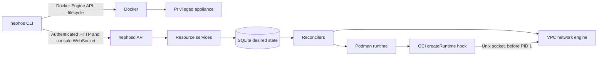

# M1 design: two instances ping across subnets

**Status:** Approved, 2026-09-23. This is the M1 integration design;
implementation plans will be written for its delivery slices.

## Intent and agreed boundaries

M1 gives a contributor a locally built Nephos appliance that can create two
real Linux instances through the CLI and API, place them in different subnets
of one VPC, and pass an ICMP packet between them. Stopping and restarting the
appliance must reconstruct that state from SQLite. A soft reset must leave no
Nephos runtime objects behind. The result is an end-to-end foundation for the
later networking and learning milestones, not a release-ready installer.

The contributor first builds the appliance and `ubuntu-24.04` development AMI
locally. M1 has one implicit `default` workspace and retains the
`/v1/workspaces/default/...` resource path. VPCs are created explicitly. M1
implements the core ADR-0008 contract for its resources; arbitrary tags and
broader list filters are assigned to M3. It does not implement a default VPC,
internet edge, user-managed route tables, security groups, NACLs, SSH access,
key pairs, DNS, IMDS, user data, a published AMI pipeline, or a web console.
The serial-console analog is the one labeled out-of-band access path.

The accepted decisions remain in force: [appliance packaging](../../adr/0003-appliance-container-packaging.md),
[Podman instances](../../adr/0004-instances-as-system-containers.md),
[routed networking](../../adr/0005-nephos-owned-routed-network-plane.md),
[SQLite reconciliation](../../adr/0007-sqlite-state-and-reconciliation.md), and
[REST/OpenAPI](../../adr/0008-rest-openapi-api-not-aws-compatible.md).
No new runtime or network decision is proposed.

## Delivery approach

Two approaches were considered:

1. **Four reviewable increments within M1 — selected.** Each increment adds
   a path from a user command to an observable result. Contract and failure
   tests land with the relevant increment. This costs some integration work
   between pull requests but exposes mistakes before the full appliance is
   assembled.
2. **One integrated M1 change.** It avoids temporary incomplete interfaces,
   but mixes first-time API, store, network, compute, and packaging work in a
   single review and leaves the end-to-end test until late.

The four increments are: (1) local image build, appliance startup, token, and
health; (2) VPC/subnet commands through the API, store, reconciler, and kernel;
(3) instance creation, OCI hook, console, and ping; (4) restart, reset, failure
injection, and CI/WSL verification. They remain one roadmap milestone. The
roadmap's 45–55 hour estimate is provisional until implementation plans size
these increments.

The milestone boundaries and concrete mechanics below are approved, including
bundling a local OCI AMI archive into the appliance build, bootstrapping the
API token through Docker's archive API, and using an authenticated WebSocket
for console exec. The first delivery
slice must validate image import and token bootstrap on both native Docker
and WSL2 before later slices depend on them.

## M1 component boundary

`cmd/*` wires components; behavior belongs in the `internal/` packages named
in [ARCHITECTURE §13](../../ARCHITECTURE.md#13-repository-structure). The CLI
uses the generated Go client for resources and the Docker Engine API for
appliance lifecycle. Resource services validate and transact; reconcilers
operate the network and Podman engines. Neither engine imports API or service
packages. Only `internal/network/netns` enters network namespaces. The M0
spike code remains evidence, not a production dependency.

## Appliance, images, and credentials

`make dev-ami` produces a local OCI archive from the development Ubuntu 24.04
image definition. `make appliance` builds an appliance image containing
`nephosd`, `nephos-hook`, Podman, required network tools, and that archive.
On first start, the appliance imports the archive into Podman's store on the
`nephos-data` volume. The archive is a development convenience; M2 separates
and publishes the AMI. The build instructions state their prerequisites and
show how to rebuild after changing either image. `nephos up` uses the local
appliance image and reports the build commands when it is absent; it does not
build images implicitly.

`nephos up` checks Docker reachability, rootful mode, cgroup v2, the kernel
version floor, supported architecture, and enough memory and disk for its
fixed limits. Appliance startup checks `nf_tables`, `veth`, `dummy`, nftables,
and namespace support from inside its own namespace. The entrypoint
delegates `memory`, `pids`, and `cpu` to a leaf cgroup and refuses to start if
any controller is unavailable. Docker creates one privileged `nephos`
container with its own network and PID namespaces, private cgroup namespace,
the `nephos-data` volume at `/var/lib/nephos`, fixed resource limits, and
`127.0.0.1:7788` published for the API. There are no host bind mounts, host
network or PID modes, global sysctl changes, or Docker networks modeling VPCs.

On first boot, the appliance generates a random API bearer token and stores
it under `/var/lib/nephos/secrets` with restrictive permissions. The CLI,
which already needs local Docker Engine access to run the appliance, retrieves
it through that engine's archive API and
writes `~/.nephos/credentials` with mode `0600`; the secret is never placed in
Docker environment variables, command arguments, logs, or image layers. An
ordinary `down`/`up` keeps the token. `reset --hard` destroys the old volume,
creates a new token, and replaces the CLI credential file. The API rejects
missing and invalid tokens on every M1 endpoint except `/v1/health`.

`nephos up` waits for `/v1/health` to report ready and surfaces startup
errors. `nephos status` distinguishes missing, stopped, starting, ready, and
unhealthy appliances. `nephos down` stops the appliance while preserving the
volume. `nephos down --purge` removes the stopped container and volume without
restarting; `reset --hard` uses that purge path before a fresh `up`, as
ADR-0003 specifies. The standalone `doctor` grows into its full diagnostic
form in M8; M1 startup still performs the checks needed to fail closed.

## API and CLI contract

`api/openapi.yaml` is written before generated Go server interfaces and
`pkg/client`. Generator versions are pinned, and CI checks generated-code
freshness. TypeScript generation waits for the M6 web console. M1 exposes:

| Resource | Operations |
|---|---|
| `/v1/workspaces/default/vpcs` | Create, list, describe by ID, delete |
| `/v1/workspaces/default/subnets` | Create, list, describe by ID, delete |
| `/v1/workspaces/default/instances` | Run, list, describe by ID, terminate |
| `/v1/workspaces/default/reset` | Authenticated soft reset and leak-check result |
| `/v1/workspaces/default/instances/{id}/console` | Authenticated WebSocket exec session |
| Global | `/v1/health`, authenticated `/v1/version`, and authenticated `/v1/events` |

VPC creation requires `name` and `cidr_block`. Subnet creation requires
`name`, `vpc_id`, `cidr_block`, and an AZ from `local-1a`, `local-1b`, or
`local-1c`. Instance run requires `name` and `subnet_id` and uses the sole
M1 development image and fixed `t3.micro` type. M1 does not accept AMI or
instance-type selection; unknown request fields are rejected rather than
silently ignored. M2 introduces selectable AMI IDs and instance types.
Responses include each resource's ID, name, desired fields, state, state reason, and
generation/observed-generation values; instance responses also expose its
private IP and ENI ID. Delete/terminate operations are asynchronous except
for dependency-validation failures. Soft reset waits for teardown and returns
its leak-check result. `/v1/health` returns a non-ready status during startup
and ready only after the initial reconcile sweep.

`/v1/version` reports the API version and appliance build identifier. The API
returns JSON with snake_case fields. Resource IDs use the ADR-0008
prefixes and 17 lowercase hexadecimal characters; names are unique by type
in the default workspace. API paths use IDs; the CLI resolves a name or ID.
Unknown workspace paths fail rather than creating another workspace. Lists
support `limit` and opaque `page_token`, with deterministic ID ordering.
Arbitrary tags and broader filters are intentionally absent until M3.

Creates return a transitional resource. The optional `Idempotency-Key` header
is generated once per CLI create invocation and reused for its retries. The
workspace, operation, and key identify a keyed create request for 24 hours;
a replay with the
same payload returns the original result and cannot allocate another ID or IP.
Reuse with a different payload returns a conflict error. Validation and
idempotency records are written in the same SQLite transaction as desired
state and an event row.
Errors use ADR-0008's JSON envelope, AWS-style codes where applicable, and
non-2xx HTTP status. VPC deletion with subnets and subnet deletion with
instances return `DependencyViolation`.

`/v1/events` reads durable event rows and streams them with monotonically
increasing IDs. Reconnects resume via `Last-Event-ID`. The event
stream cannot be the only way a client discovers state: `--wait` can poll a
resource GET after reconnect or event loss. `--wait` ends when the requested
state is observed, returns a nonzero error with `state_reason` on `failed`,
and times out with a nonzero error after a default two-minute deadline,
overridable by `--timeout`. For M1,
`running` means Podman has started after the hook wired `eth0`; it does not
claim that sshd or cloud-init is ready.

The CLI offers the M1 verbs in the roadmap, `-o json` for exact API objects,
and human-readable default output. `nephos console <instance> [-- command]`
uses an authenticated WebSocket to a `nephosd` Podman exec session. It supports
an interactive shell and one-shot command mode, propagates command exit
status, and labels the session out of band. The exec transport bypasses VPC
access rules; packets sent by a command inside the instance still traverse
the VPC router. The CLI never reaches into Podman from the host.

## Store and reconciliation

The first embedded migration creates `workspaces` with the sole `default`
row, `vpcs`, `subnets`, `instances`, `enis`, `events`, and
`idempotency_requests`. Resource tables carry `generation`,
`observed_generation`, `state`, and `state_reason`. Foreign keys enforce
relationships. SQLite runs in WAL mode with foreign keys enabled and a
busy timeout; the pure-Go driver and `sqlc` follow ADR-0007. A database
allocated short index supplies stable kernel namespace and interface names.
Resource state, IP leases, and events have no second durable source of truth.

For a create, the service validates input, reserves IDs and IPs, writes the
desired row and event, commits, then enqueues reconcile keys. A process crash
between commit and enqueue is repaired by startup and periodic resync. IPAM
reserves network, `.1`, `.2`, `.3`, and the last address; the first assignable
address is `.4`. Concurrent allocations are serialized by the database and
protected by a unique constraint. VPC CIDRs may overlap each other; subnets
must fit inside their VPC and not overlap siblings. M1 assigns private IPs
automatically and keeps them across appliance restart.

One worker acts on a resource key at a time. Network prerequisites converge
before instance start. Engine operations are idempotent, and reconcilers write
observed generation only after they observe the requested effect. On an
operation error, the affected resource becomes `failed` with a useful reason
and is retried with backoff. Reconcilers never mark an instance running when
the hook failed. Startup runs migrations and orphan collection, completes an
initial reconcile sweep of persisted VPCs and instances, and only then reports
ready; individual failed resources remain visible. A full resync runs every
60 seconds. Garbage collection acts only on Nephos-prefixed namespaces,
Nephos-labeled containers, and their known child objects.

## Network and compute behavior

Each explicit VPC gets one `nx-vpc-<short>` namespace. Subnets are logical:
their `.1` gateways live on the VPC router, with no bridge or Podman subnet
network. An instance ENI uses a veth pair; the router end has proxy ARP and a
`/32` route, and the instance end is `eth0`. The local VPC route allows
same-subnet and cross-subnet traffic to traverse the VPC router. Different
VPC namespaces have no link, even with overlapping CIDRs. Unmatched traffic
is blackholed. Only per-namespace sysctls change. M1 adds the default
source-address anti-spoof check, but exposes no SG or NACL objects and makes
no claim that those later policies are enforced.

The `compute.Runtime` adapter speaks to rootful Podman's local REST service.
It creates system containers with `systemd=always`, `userns=auto`, the
`t3.micro` CPU/memory/pids limits, default capabilities plus `CAP_NET_ADMIN`
inside the instance namespace, default seccomp, no devices, and Nephos labels.
Its writable layer and cached image live on `nephos-data`. The development
AMI contains systemd and `ping`; the M1 check does not depend on SSH, DNS,
metadata, or user data.

The OCI `createRuntime` hook applies only to Nephos-labeled containers. It
reads Podman's state from stdin and calls `nephosd` over HTTP on the Unix
socket `/run/nephos/hook.sock`, as SP2 proved. The daemon verifies the
instance identity and desired ENI, then plumbs `eth0` before PID 1 runs. A
failure makes the hook exit nonzero, leaves the instance `failed`, and
triggers cleanup or retry of partially created links. Two concurrent
launches cannot reuse an interface index or IP. The hook socket remains
inside the appliance and is never published to the host or mounted into
instances.

## Restart, deletion, and reset

`nephos down` stops the appliance, so running nested processes may disappear.
`nephos up` reuses the volume, observes Podman and kernel state, repairs or
recreates Nephos objects from SQLite, and returns instances with the same
private IPs and writable-root files. Runtime IDs are cached observations,
not authoritative desired state. A restart test writes a marker inside an
instance, records its IP, restarts the appliance, and verifies the marker,
IP, instance status, and cross-subnet ping.

`instance terminate` deletes its Podman container and ENI, releases the IP
after teardown, emits events, and removes the resource from active lists.
M2 adds the one-hour terminated-instance visibility window. `subnet delete`
and `vpc delete` require dependents to be gone. `nephos reset` is an
authenticated daemon operation that deletes instances, subnets, then VPCs,
waits for reconciliation, and runs the leak checker. In M1 the default
workspace remains, but has no VPC or instance afterwards. The leak checker
inspects labeled Podman containers, `nx-*` namespaces, Nephos nftables
objects, and orphan veths; it reports any residue as an error.

`nephos reset --hard` runs through the host Docker API: stop and remove the
old appliance, remove its named volume, then perform a fresh `up`. It must
show that the old container and volume are gone and that the new appliance
has empty M1 resource state and a new token. It never reports success after
a partial purge. M3's default-VPC creation will change the fresh initial
resource set as documented in the roadmap.

## Verification and acceptance

Unit tests cover CIDR and name validation, reserved addresses, concurrent
IPAM, idempotency-key replay/conflict, migration startup, event ordering,
reconcile backoff, and failures through fake network and compute engines.
Linux integration tests exercise namespace and Podman adapters and confirm
the hook fails closed. The e2e suite builds local images, runs the roadmap
demo on an Ubuntu 24.04 Docker runner, verifies the restart marker and IP,
tests overlapping VPC isolation, injects a hook failure, and runs both reset
levels. It checks that appliance actions never alter the host network
namespace, routes, or firewall. Token tests cover missing/invalid tokens,
localhost binding, persistence across `down`/`up`, and replacement on hard
reset. The same demo is run manually on Windows 10 with WSL2 and Docker
Desktop. The CI job collects appliance logs and leak-checker output on
failure and always cleans up its own test container and volume.

M1 closes only when every [ROADMAP M1](../../ROADMAP.md#m1-thinnest-end-to-end-slice-two-instances-ping)
checkbox passes. `make generate`, `make appliance`, and `make e2e` become
real targets; normal builds remain `CGO_ENABLED=0`. Later milestones retain
their existing boundaries, and any implementation that reverses an accepted
ADR requires a superseding ADR before code proceeds.
